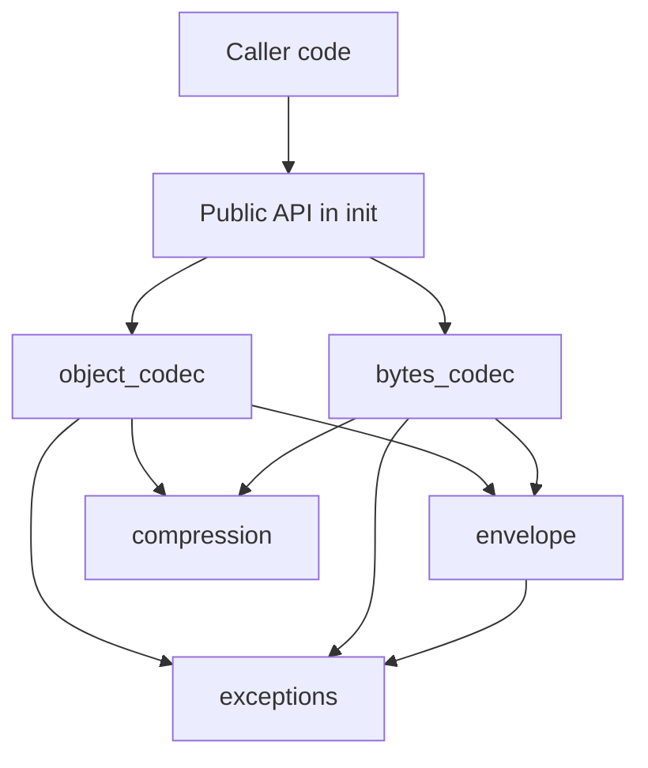
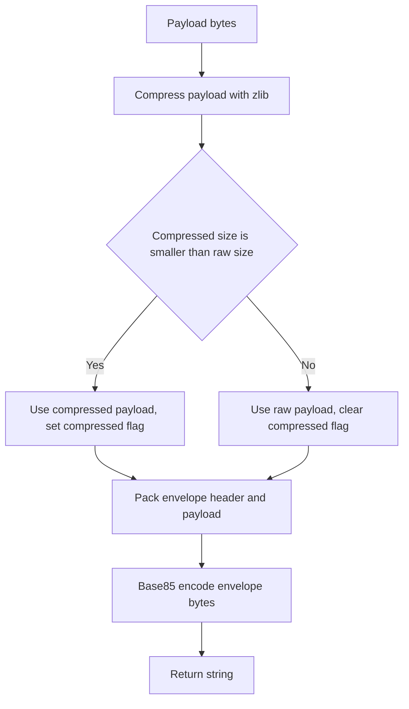
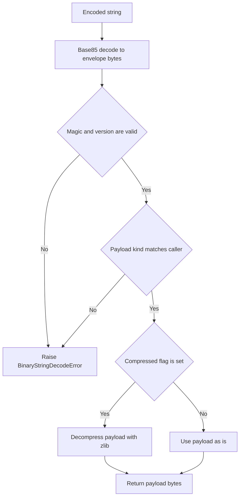

# Technical Design Document

## Overview

本機能は、任意の `bytes` および `pickle` 化可能な任意の Python オブジェクトを、JSON/TOML 等のテキストベースファイルに安全に埋め込める文字列へ可逆的に変換する `binary_string_codec` サブパッケージを提供する。Base85 エンコードと zlib 圧縮の組み合わせにより、Base64 単純エンコードと比較して情報密度を高め、圧縮が有効なデータではエンコード後サイズを大幅に削減する。

**Purpose**: バイナリデータおよび構造化データモデル（dataclass 等）を、`python_util` の他サブパッケージと同じ規約に沿った公開APIで、コンパクトかつ安全に文字列化・復元する手段を提供する。
**Users**: `python_util` を利用する個人プロジェクトの開発者（本人）が、設定ファイルやデータファイル（JSON/TOML）にバイナリデータやオブジェクトを埋め込む際に利用する。
**Impact**: 新規サブパッケージの追加のみであり、既存の `logging` / `time_utility` には一切変更を加えない。

### Goals
- `bytes` および pickle 化可能な任意の Python オブジェクトを、JSON/TOML に安全に埋め込める文字列に変換し、完全に復元できること
- Base64 単純エンコードよりも高い情報密度を実現し、圧縮が有効なデータではエンコード後サイズを大きく削減すること
- 外部依存を追加せず、標準ライブラリのみで実現すること
- `logging` / `time_utility` と一貫した公開API・例外設計・テスト構成に従うこと

### Non-Goals
- 暗号化・署名等のセキュリティ機能（[research.md](research.md) の pickle セキュリティ調査に基づき、信頼できない入力からの保護は本機能のスコープ外）
- JSON/TOML ファイル自体の読み書き（本機能は文字列⇔バイナリ/オブジェクトの変換のみを提供する）
- ネットワーク経由のシリアライズ/デシリアライズプロトコル
- 大容量データ（数百KB〜MB）に最適化された圧縮方式の選定（[research.md](research.md) の Research Needed に記載の通り、将来必要になった場合に再評価する）

## Boundary Commitments

### This Spec Owns
- `bytes` ⇔ 文字列の可逆変換（エンコード/デコード）
- pickle 化可能な Python オブジェクト ⇔ 文字列の可逆変換（エンコード/デコード）
- エンコード結果文字列の内部フォーマット（envelope構造）の定義と、その形式に対するバージョニング・破損検出
- 圧縮要否判定ロジックと、その判定に用いる比較基準

### Out of Boundary
- 呼び出し側が生成したデータをどのようにJSON/TOMLファイルへ書き込むか（呼び出し側の責務）
- デコード対象文字列の発信元が信頼できるかどうかの検証（呼び出し側の責務。本機能はdocstringで注意喚起するのみ）
- `pyproject.toml` の `[tool.python_util.binary_string_codec]` によるオーバーライド機構（Requirements Boundary Contextの通り本スペックでは扱わない）

### Allowed Dependencies
- Python標準ライブラリ: `base64`, `zlib`, `pickle`, `dataclasses`（型定義用途）
- `python_util` パッケージ内の他サブパッケージへの依存は持たない（独立したサブパッケージとする）

### Revalidation Triggers
- envelopeのバイト配置（magic/version/flags）を変更する場合
- 圧縮アルゴリズムの追加・変更を行う場合（`flags` のkind/compressedビット割り当てに影響する場合）
- 公開関数のシグネチャ（`encode_bytes` / `decode_bytes` / `encode_object` / `decode_object`）を変更する場合

## Architecture

### Architecture Pattern & Boundary Map



**Architecture Integration**:
- Selected pattern: レイヤードモジュール構成（envelope/compressionを共通基盤層、bytes_codec/object_codecをそれぞれ独立したコーデック層、`__init__.py` を公開API層とする単一サブパッケージ内の階層分割）
- Domain/feature boundaries: `bytes_codec` と `object_codec` は共通のenvelope形式・圧縮判定ロジックを共有するが、互いに依存しない（envelope/compressionを介して疎結合）
- Existing patterns preserved: `structure.md` のサブパッケージ構成（`__init__.py` に公開APIを集約、内部モジュールは非公開）、`time_utility.exceptions` の例外設計パターンを踏襲
- New components rationale: envelopeとcompressionを独立モジュールに分離することで、bytesコーデックとオブジェクトコーデックの双方から再利用し、圧縮判定ロジックの重複を避ける
- Steering compliance: 外部依存追加なし（`tech.md`）、型ヒント必須・`from __future__ import annotations` 宣言・専用例外クラスの`exceptions.py`集約（`tech.md`）

### Technology Stack

| Layer | Choice / Version | Role in Feature | Notes |
|-------|------------------|-----------------|-------|
| エンコード | `base64.b85encode` / `b85decode`（標準ライブラリ） | envelopeバイト列と印字可能ASCII文字列間の変換 | Base64比約6%サイズ削減を実測済み（[research.md](research.md)）。出力文字集合に `"` `\` `'` を含まずJSON/TOML埋め込みに安全（実測確認済み） |
| 圧縮 | `zlib`（標準ライブラリ、圧縮レベル9） | 圧縮が有効なデータのサイズ削減 | `bz2`/`lzma`は小〜中規模データでオーバーヘッドが大きく本用途に不適と判断（[research.md](research.md) 参照） |
| オブジェクトシリアライズ | `pickle`（標準ライブラリ、`HIGHEST_PROTOCOL`） | 任意Pythonオブジェクトのバイナリ化 | 信頼できない入力のデコードは任意コード実行リスクを伴う（[research.md](research.md) のセキュリティ調査参照）。本機能は暗号署名等の対策を実装せず、docstringでの注意喚起に留める |

## File Structure Plan

### Directory Structure
```
src/
└── python_util/
    └── binary_string_codec/
        ├── __init__.py       # 公開APIの集約（encode_bytes, decode_bytes, encode_object, decode_object, 例外クラス）
        ├── exceptions.py      # BinaryStringDecodeError, ObjectPickleError
        ├── envelope.py         # magic/version/flagsのpack/unpack、_PayloadKind定義
        ├── compression.py      # zlib圧縮要否判定ロジック
        ├── bytes_codec.py      # encode_bytes / decode_bytes の実装
        └── object_codec.py     # encode_object / decode_object の実装（pickle利用）
tests/
└── binary_string_codec/
    ├── __init__.py
    ├── test_envelope.py
    ├── test_compression.py
    ├── test_bytes_codec.py
    ├── test_object_codec.py
    ├── test_exceptions.py
    └── test_public_api.py      # tests/time_utility/test_public_api.py と同パターン
```

> `envelope.py` と `compression.py` は `bytes_codec.py` / `object_codec.py` の双方から再利用される基盤モジュールであり、依存の向き（後述）はこの2層構造から外れない。

### Modified Files
なし（新規サブパッケージ追加のみ。既存ファイルへの変更はない）

**依存方向**: `exceptions.py` → `envelope.py`（envelopeのみexceptionsに依存） ／ `compression.py`（外部依存なし、標準ライブラリ`zlib`のみを利用する独立モジュール） → 両者に依存する `bytes_codec.py` / `object_codec.py` → `__init__.py`。`envelope.py` と `compression.py` は互いに依存しない並列コンポーネントであり、各モジュールは自身より左側（またはこの並列関係にある）モジュールのみを import し、逆方向のimportは行わない。

## System Flows

### エンコード共通フロー（圧縮要否判定を含む）



**Key Decisions**: 圧縮の要否は「圧縮後の生バイト長 < 無圧縮の生バイト長」で判定する（Requirement 3.3）。Base85は固定の拡張率（8バイト→10文字）で符号化するため、Base85エンコード後の文字列長で比較しても生バイト長で比較しても大小関係は変わらない。したがって圧縮のたびにBase85エンコードを試行する必要はなく、生バイト長の比較のみで足りる（実装コストと実行コストの削減）。

### デコード共通フロー（種別検証・破損検出を含む）



**Key Decisions**: `CheckKind` は Requirement 4.3 に対応する検証であり、`decode_bytes` が `encode_object` の出力を受け取った場合（またはその逆）を検出して `BinaryStringDecodeError` を送出する。Base85デコード失敗・マジック不一致・zlib展開失敗はいずれも `BinaryStringDecodeError` に集約する（Requirement 4.4）。

## Requirements Traceability

| Requirement | Summary | Components | Interfaces | Flows |
|-------------|---------|------------|------------|-------|
| 1.1, 1.3, 1.4 | 任意長の`bytes`を`str`にエンコード | bytes_codec, envelope, compression | `encode_bytes` | エンコード共通フロー |
| 1.2 | エンコード結果は印字可能ASCIIのみ | bytes_codec（Base85経由） | `encode_bytes` | エンコード共通フロー |
| 2.1, 2.2, 2.3 | デコードによる完全な往復整合性 | bytes_codec, envelope, compression | `decode_bytes` | デコード共通フロー |
| 3.1 | Base64より高密度な方式の採用 | envelope, bytes_codec | `encode_bytes` / `encode_object` | エンコード共通フロー |
| 3.2, 3.3, 3.4 | 圧縮適用とフォールバック、判定情報の保持 | compression, envelope | 内部関数（非公開） | エンコード共通フロー |
| 3.5, 3.6 | 圧縮アルゴリズムの比較検証と優位性 | compression | — | research.md 記載のベンチマーク結果に基づく設計選択（zlib採用） |
| 4.1, 4.2 | 型不正時の`TypeError`送出 | bytes_codec, object_codec | 全公開関数 | — |
| 4.3, 4.4 | 不正形式・破損データの専用例外送出 | envelope, bytes_codec, object_codec | `decode_bytes` / `decode_object` | デコード共通フロー |
| 5.1, 5.2 | オブジェクトのバイナリ化と復元 | object_codec, envelope, compression | `encode_object` / `decode_object` | エンコード/デコード共通フロー |
| 5.3 | pickle不可オブジェクトの専用例外送出 | object_codec | `encode_object` | — |
| 5.4 | 不正/破損オブジェクト文字列の専用例外送出 | object_codec, envelope | `decode_object` | デコード共通フロー |
| 5.5 | セキュリティ注意のdocstring明記 | object_codec, `__init__.py` | `decode_object` | — |
| 6.1, 6.2, 6.3, 6.4 | 公開API集約・型ヒント・例外集約・テスト構成 | `__init__.py`, exceptions | 全公開関数 | — |

## Components and Interfaces

| Component | Domain/Layer | Intent | Req Coverage | Key Dependencies (P0/P1) | Contracts |
|-----------|--------------|--------|--------------|--------------------------|-----------|
| exceptions | 基盤 | サブパッケージ固有の例外を定義 | 4.3, 4.4, 5.3, 5.4, 6.3 | なし | State |
| envelope | 基盤 | ヘッダ（magic/version/flags）のpack/unpackとペイロード種別定義 | 1.2, 2.1-2.3, 3.4, 4.3, 4.4 | exceptions (P0) | State |
| compression | 基盤 | zlib圧縮の要否判定 | 3.2, 3.3, 3.5, 3.6 | なし | State |
| bytes_codec | コーデック | `bytes`⇔`str`の公開エンコード/デコード関数を提供 | 1.1-1.4, 2.1-2.3, 4.1, 4.2, 4.3, 4.4 | envelope (P0), compression (P0), exceptions (P0) | Service |
| object_codec | コーデック | Pythonオブジェクト⇔`str`の公開エンコード/デコード関数を提供 | 5.1-5.5, 4.1, 4.2 | envelope (P0), compression (P0), exceptions (P0), pickle (P0, 標準ライブラリ) | Service |
| `__init__.py`（公開API） | 公開層 | サブパッケージの公開APIを`__all__`に集約 | 6.1, 6.2, 6.4 | bytes_codec (P0), object_codec (P0), exceptions (P0) | Service |

### 基盤層

#### envelope

| Field | Detail |
|-------|--------|
| Intent | エンコード対象ペイロードにマジックバイト・バージョン・フラグを付与し、デコード時に本コーデック生成物であることと圧縮/種別情報を検証可能にする |
| Requirements | 1.2, 2.1, 2.2, 2.3, 3.4, 4.3, 4.4 |

**Responsibilities & Constraints**
- envelopeのバイト配置を一元管理し、`bytes_codec`/`object_codec`の双方から共通利用される
- マジックバイト・バージョン不一致、ペイロード種別不一致、および構造的に不正なバイト列を検出して `BinaryStringDecodeError` を送出する
- 圧縮の有無・ペイロード種別（bytes/object）を1バイトのフラグ領域で表現する

**Dependencies**
- Outbound: exceptions — 検証失敗時の例外送出 (P0)

**Contracts**: Service [x] / State [x]

##### Service Interface

```python
class _PayloadKind(enum.IntEnum):
    BYTES = 0
    OBJECT = 1

def pack(payload: bytes, *, compressed: bool, kind: _PayloadKind) -> bytes: ...
def unpack(data: bytes, *, expected_kind: _PayloadKind) -> tuple[bytes, bool]: ...
```

- Preconditions: `unpack` の `data` は `bytes` 型であること（呼び出し元の `bytes_codec`/`object_codec` が Base85 デコード後に渡す）
- Postconditions: `unpack(pack(payload, compressed=c, kind=k), expected_kind=k) == (payload, c)` が任意の `payload: bytes` について成立する
- Invariants: `pack` が返すバイト列は常に4バイト以上（固定ヘッダ長）である

##### State Management
- State model: envelopeは以下の固定ヘッダ＋可変長ペイロードで構成される（不変・ステートレスな値表現）

| Offset | Field | Size | Description |
|---|---|---|---|
| 0-1 | magic | 2 bytes | ASCII `BS`。本コーデックが生成した文字列であることの判定に用いる（4.3） |
| 2 | version | 1 byte | envelope形式のバージョン（現在 `0x01`）。将来の形式変更検出に用いる |
| 3 | flags | 1 byte | bit0: 圧縮フラグ（1=zlib圧縮済み）／bit1: ペイロード種別（0=bytes, 1=pickle化オブジェクト）／bit2-7: 予約（常に0） |
| 4- | payload | 可変長 | 実データ本体（圧縮有無・種別はflagsに従う） |

- Persistence & consistency: envelope自体は永続化されず、`encode_bytes`/`encode_object`呼び出しの都度メモリ上に構築されBase85文字列に変換される
- Concurrency strategy: 状態を持たない純粋な変換関数として実装するため、並行呼び出しに関する追加考慮は不要

**Implementation Notes**
- Integration: `_PayloadKind`（`BYTES` / `OBJECT`）をenvelope内で定義し、bytes_codec/object_codecの双方が参照する
- Validation: `unpack`関数は magic 不一致・version 不一致・flags予約ビット非ゼロ・ペイロード種別の呼び出し元期待値との不一致のいずれかで `BinaryStringDecodeError` を送出する
- Risks: envelope形式を将来変更する場合は version フィールドをインクリメントし、旧バージョンのデコード可否を設計時に判断する必要がある（Revalidation Trigger）

#### compression

| Field | Detail |
|-------|--------|
| Intent | ペイロードにzlib圧縮を適用すべきかを判定し、圧縮後データまたは元データのいずれかを返す |
| Requirements | 3.2, 3.3, 3.5, 3.6 |

**Responsibilities & Constraints**
- 圧縮後の生バイト長が無圧縮の生バイト長より小さい場合のみ圧縮を採用する（[research.md](research.md) の実測ベンチマークに基づく判定基準）
- 圧縮アルゴリズムは `zlib`（レベル9）に固定する。`bz2`/`lzma`は小〜中規模データでのオーバーヘッドが大きく不採用（research.md 参照）

**Dependencies**
- なし（標準ライブラリ `zlib` のみ）

**Contracts**: Service [x] / State [x]

##### Service Interface

```python
def compress_if_smaller(payload: bytes) -> tuple[bytes, bool]: ...
```

- Preconditions: `payload` は `bytes` 型であること
- Postconditions: 戻り値の第2要素（圧縮フラグ）が `True` の場合、第1要素は `zlib.compress(payload, level=9)` の結果であり、かつ `len(第1要素) < len(payload)` を満たす。`False` の場合、第1要素は `payload` そのものである
- Invariants: 本関数は例外を送出しない（`zlib.compress`は`bytes`入力に対して失敗しないため、専用の例外処理は不要）

##### State Management
- State model: 入力ペイロードから `(選択されたペイロードbytes, 圧縮フラグbool)` を返す純粋関数
- Persistence & consistency: 該当なし（ステートレス）
- Concurrency strategy: 該当なし（ステートレス）

**Implementation Notes**
- Validation: 圧縮判定は生バイト長の比較のみで行い、Base85エンコードを都度試行しない（System Flows のKey Decisions参照）
- Risks: 大容量データにおける`zlib`以外の選択肢の要否はResearch Needed（research.md）として設計後に再評価する

### コーデック層

#### bytes_codec

| Field | Detail |
|-------|--------|
| Intent | `bytes` を安全な `str` にエンコードし、また完全に復元するデコード関数を提供する |
| Requirements | 1.1, 1.2, 1.3, 1.4, 2.1, 2.2, 2.3, 4.1, 4.2, 4.3, 4.4 |

**Responsibilities & Constraints**
- 入力が `bytes` 型でない場合は `TypeError` を送出する（4.1）
- デコード入力が `str` 型でない場合は `TypeError` を送出する（4.2）
- envelopeのペイロード種別を `_PayloadKind.BYTES` に固定してpack/unpackする

**Dependencies**
- Outbound: envelope — ヘッダのpack/unpackとペイロード種別検証 (P0)
- Outbound: compression — 圧縮要否判定 (P0)
- Outbound: exceptions — 型不正以外のデコードエラー送出 (P0)

**Contracts**: Service [x]

##### Service Interface
```python
def encode_bytes(data: bytes) -> str: ...
def decode_bytes(text: str) -> bytes: ...
```
- Preconditions: `encode_bytes` は `data` が `bytes` 型であること。`decode_bytes` は `text` が `str` 型であること
- Postconditions: `decode_bytes(encode_bytes(data)) == data` が任意の `bytes` について成立する（2.2）
- Invariants: `encode_bytes` の戻り値は印字可能ASCII文字のみで構成される（1.2）

**Implementation Notes**
- Integration: `encode_bytes`は`compression`で圧縮要否を判定した後、`envelope`でヘッダを付与し、`base64.b85encode`で文字列化する
- Validation: `decode_bytes`は`envelope`でペイロード種別が`BYTES`であることを検証し、`OBJECT`であれば`BinaryStringDecodeError`を送出する
- Risks: なし

#### object_codec

| Field | Detail |
|-------|--------|
| Intent | pickle化可能な任意のPythonオブジェクトを `str` にエンコードし、また元のオブジェクトに復元するデコード関数を提供する |
| Requirements | 5.1, 5.2, 5.3, 5.4, 5.5, 4.2 |

**Responsibilities & Constraints**
- `pickle.dumps` に失敗したオブジェクトに対しては `ObjectPickleError` を送出する（5.3）。元例外は `__cause__` として保持する
- デコード入力が `str` 型でない場合は `TypeError` を送出する（4.2）
- envelopeのペイロード種別を `_PayloadKind.OBJECT` に固定してpack/unpackする
- 公開関数のdocstringに、信頼できない発信元の文字列をデコードすると任意コード実行のリスクがある旨を明記する（5.5）

**Dependencies**
- Outbound: envelope — ヘッダのpack/unpackとペイロード種別検証 (P0)
- Outbound: compression — 圧縮要否判定 (P0)
- Outbound: exceptions — pickle失敗・デコードエラー送出 (P0)
- External: `pickle`（標準ライブラリ） — オブジェクトのシリアライズ/デシリアライズ (P0)

**Contracts**: Service [x]

##### Service Interface
```python
def encode_object(obj: object) -> str: ...
def decode_object(text: str) -> object: ...
```
- Preconditions: `decode_object` は `text` が `str` 型であること。`decode_object` に渡す文字列は信頼できる発信元（本コーデックの `encode_object` が生成したもの）であること（呼び出し側責務、docstringで明記）
- Postconditions: 任意のpickle化可能な `obj` について、`decode_object(encode_object(obj))` は `obj` と同一の型を持ち、`obj` の全属性（`pickle`がシリアライズ対象とする状態）を値として保持するオブジェクトを返す（5.2）。ただし `obj` のクラスが `__eq__` を独自定義していない場合、Pythonの既定の等価性は同一性（identity）ベースであるため `decode_object(encode_object(obj)) == obj` は `False` となりうる点に注意する。この場合の等価性は `==` ではなく属性値の比較（例: `vars(obj) == vars(decoded)` やフィールド単位の比較）で検証する
- Invariants: `encode_object` の戻り値は `bytes_codec.encode_bytes` と同一のenvelope形式・文字集合を用いる（種別フラグのみ異なる）

**Implementation Notes**
- Integration: `pickle.dumps(obj, protocol=pickle.HIGHEST_PROTOCOL)` の結果を`bytes_codec`と共通の圧縮・envelope処理に渡す
- Validation: `decode_object`は`envelope`でペイロード種別が`OBJECT`であることを検証し、`BYTES`であれば`BinaryStringDecodeError`を送出する。`pickle.loads`失敗時も`BinaryStringDecodeError`に変換する
- Risks: `pickle.loads`は信頼できないデータに対して任意コード実行を許すことが既知のリスクである（research.md参照）。本設計ではクラス許可リストや署名検証を実装せず、docstringでの注意喚起のみで対応する（Non-Goals参照）

### 公開層

#### `__init__.py`（公開API）

| Field | Detail |
|-------|--------|
| Intent | サブパッケージの公開APIを`__all__`に集約してエクスポートする |
| Requirements | 6.1, 6.2, 6.4 |

**Responsibilities & Constraints**
- `encode_bytes`, `decode_bytes`, `encode_object`, `decode_object`, `BinaryStringDecodeError`, `ObjectPickleError` をアルファベット順で`__all__`に列挙する
- 内部モジュール（`envelope`, `compression`, `_PayloadKind`等）は非公開のまま、利用側に直接インポートさせない

**Dependencies**
- Inbound: bytes_codec, object_codec, exceptions (P0)

**Contracts**: Service [x]

**Implementation Notes**
- Integration: `time_utility/__init__.py` と同一パターン（一行docstring＋import＋`__all__`）
- Validation: `tests/binary_string_codec/test_public_api.py` で全公開シンボルのインポート可能性と往復動作を検証する
- Risks: なし

## Data Models

envelopeのバイト配置は「基盤層 / envelope」セクションの表を正とする（本セクションでの重複記載は避ける）。本機能はデータベースやファイルストレージを持たず、永続化される論理データモデルは存在しない。データ契約はコーデック関数のシグネチャ（Service Interface）がそのまま該当する。

## Error Handling

### Error Strategy
入力値の型不正は早期に`TypeError`で検出し、デコード対象データの内容不正（envelope破損・種別不一致・pickle失敗）は専用例外（`ValueError`継承）で通知する。いずれも`time_utility.exceptions`の設計（`{value!r}`形式での日本語メッセージ）を踏襲する。

### Error Categories and Responses
- **型不正（呼び出し側のプログラミングエラー）**: `encode_bytes`に`bytes`以外、`decode_bytes`/`decode_object`に`str`以外が渡された場合 → 即座に`TypeError`を送出（4.1, 4.2）
- **デコード対象データの内容不正**: マジックバイト不一致・バージョン不一致・ペイロード種別不一致・zlib展開失敗・pickle復元失敗 → `BinaryStringDecodeError`を送出し、原因を`__cause__`に保持する（4.3, 4.4, 5.4）
- **エンコード対象オブジェクトのpickle不可**: `encode_object`に渡されたオブジェクトが`pickle.dumps`できない場合 → `ObjectPickleError`を送出し、元の`pickle.PicklingError`等を`__cause__`に保持する（5.3）

### Monitoring
個人用ユーティリティライブラリであり、専用の監視・ロギング基盤は持たない。例外はすべて呼び出し側に伝播させる方針とする（`logging`サブパッケージとの統合は本スペックのスコープ外）。

## Testing Strategy

### Unit Tests
- `envelope`: pack/unpack の往復整合性、magic/version不一致時の`BinaryStringDecodeError`送出、ペイロード種別不一致の検出
- `compression`: 圧縮後が無圧縮より大きい場合のフォールバック、圧縮が有効なデータでの選択、空バイト列での動作
- `bytes_codec`: `encode_bytes`/`decode_bytes`の往復整合性（空バイト列を含む）、非`bytes`/非`str`入力での`TypeError`
- `object_codec`: dataclassインスタンス（`__eq__`自動生成）を用いた`==`による往復整合性検証に加え、`__eq__`を独自定義していないプレーンなクラスのインスタンスを用いて属性値（`vars(obj)`）レベルでの往復整合性を検証する（Service Interface Postconditions参照）。pickle不可オブジェクトでの`ObjectPickleError`

### Integration Tests
- `decode_bytes`に`encode_object`の出力を渡した場合、およびその逆で`BinaryStringDecodeError`が送出されること（4.3）
- 破損文字列（Base85デコード不能・envelope途中切断）を`decode_bytes`/`decode_object`に渡した場合の`BinaryStringDecodeError`送出（4.4, 5.4）
- 公開API（`__init__.py`）から全シンボルがインポート可能であること（`tests/time_utility/test_public_api.py`と同パターン）

### Performance/Size Tests
- 圧縮が有効なサンプルデータ（[research.md](research.md) のtext_repeat/prose相当）について、`encode_bytes`の出力長が同一データの単純Base64エンコード長より小さいこと（3.6の回帰テストとして自動化）
- ランダムデータについて、圧縮フォールバックが機能し無圧縮Base85相当のサイズに収まること（3.3の回帰テスト）

## Security Considerations

`object_codec.decode_object` は内部で `pickle.loads` 相当の処理を行うため、信頼できない発信元の文字列をデコードすると任意コード実行を許すリスクがある（[research.md](research.md) のpickleセキュリティ調査を参照）。本設計ではクラス許可リストによる`Unpickler`制限や署名検証は実装しない。理由は、許可リスト方式が「pickle化可能な任意のオブジェクトに対応する」というRequirement 5.1と本質的に矛盾すること、および署名検証等の暗号機能はRequirementsのBoundary Contextで明示的にスコープ外とされていることの2点である。代わりに、`decode_object`の公開APIドキュメント（docstring）に「本コーデックが生成した信頼できる文字列のみをデコード対象とすること」を明記する（Requirement 5.5）。

## Supporting References
- 圧縮アルゴリズム比較ベンチマーク、Base85文字集合の安全性検証、pickleセキュリティ調査の詳細は [research.md](research.md) を参照
