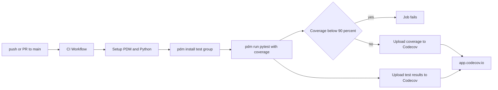
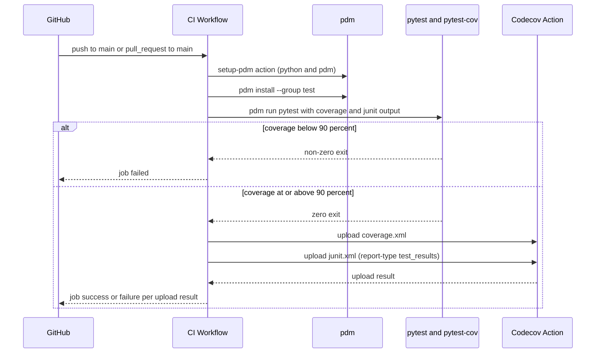

# Technical Design Document

## Overview

**Purpose**: 本機能は、GitHub Actions上のCI実行を1つの正しく動作するワークフローへ整理し、テスト実行結果とカバレッジ計測結果をCodecov(app.codecov.io)へ自動アップロードし、README上でカバレッジ状況をバッジとして可視化する。

**Users**: 本リポジトリのメンテナー（本人）が、プルリクエスト作成時・`main`へのpush時に自動的にテスト・カバレッジ検証結果を得て、README閲覧者がカバレッジ状況を一目で確認できるようにする。

**Impact**: 現在`.github/workflows/`に存在する`ci.yml`（`requirements.txt`不在により依存関係インストールが失敗する）と`unit-test.yml`（`master`ブランチ指定により実質的に発火しない）の2つの壊れたワークフローを、`pdm`ベースで正しく動作する単一のワークフロー(`ci.yml`)に置き換える。`unit-test.yml`は削除する。README.mdの冒頭にCodecovバッジを追加する。

### Goals
- 重複・破損した2つのワークフロー定義を、`main`へのpush/PRで確実に動作する単一のCIワークフローへ統合する
- カバレッジレポート・テスト結果(JUnit)をCodecovへ自動アップロードする
- カバレッジ率が90%を下回った場合にCIジョブ自体を失敗させる
- READMEにCodecovバッジを表示し、app.codecov.ioのダッシュボードへのリンクを提供する

### Non-Goals
- `codecov.yml`によるCodecov側のステータスチェック（コミットステータス）のカスタマイズ（`research.md`のDesign Decision参照。ゲートはCIジョブ内の`pytest-cov`で完結させる）
- GitHubブランチ保護ルールの設定（本スペックのコード変更では実施不可能なリポジトリ管理者のGitHub UI操作）
- `CODECOV_TOKEN`シークレットの発行・登録、app.codecov.io上でのリポジトリ有効化（いずれも本スペック外で完了済みの前提）
- Lint(ruff)のCI追加、複数Pythonバージョンでのテストマトリクス化、リリース・デプロイ自動化

## Boundary Commitments

### This Spec Owns
- `.github/workflows/`配下のCIワークフロー定義（トリガー条件、依存関係インストール手順、テスト実行コマンド、カバレッジゲート、Codecovアップロードステップ）
- CIジョブ内で完結するカバレッジしきい値(90%)の判定と失敗ステータスの報告
- README.md冒頭のCodecovバッジ表示

### Out of Boundary
- `CODECOV_TOKEN`シークレットの発行・ローテーション・登録（GitHub Settings上の手動操作。既に完了済みの前提）
- app.codecov.io上でのリポジトリの有効化・プロジェクト設定（Codecov側のSaaS操作。既に完了済みの前提）
- GitHubブランチ保護ルールでの必須ステータスチェック化（リポジトリ管理者のGitHub UI操作。本スペックのコード変更の範囲外）
- Codecov側の非同期ステータスチェック(`codecov.yml`によるコミットステータスのカスタマイズ)
- Lint/型チェックのCIへの追加、複数Pythonバージョンのテストマトリクス、デプロイ・リリース自動化

### Allowed Dependencies
- GitHub Actions公式・準公式マーケットプレイスアクション: `actions/checkout`, `pdm-project/setup-pdm`, `codecov/codecov-action`
- プロジェクトの既存パッケージ管理ツール: `pdm`（`pyproject.toml`, `pdm.lock`）
- プロジェクトの既存テスト依存関係: `pytest`, `pytest-cov`（`dependency-groups.test`に定義済み）
- GitHubリポジトリシークレット: `CODECOV_TOKEN`（読み取りのみ。値は本スペックでは扱わずワークフロー内の参照のみ）

### Revalidation Triggers
- カバレッジしきい値(90%)や対象ブランチ(`main`)を変更する場合
- パッケージ管理ツールを`pdm`から変更する場合、または`dependency-groups.test`の内容・グループ名を変更する場合
- `pdm-project/setup-pdm`または`codecov/codecov-action`のメジャーバージョンが入力契約を破壊的に変更する場合
- カバレッジゲートの実現方式を`pytest-cov`のCLIオプションから他の仕組み（例: `codecov.yml`ベースのステータスチェック）へ変更する場合

## Architecture

### Existing Architecture Analysis
- 現行の2ワークフローはいずれも実行時に失敗する（`requirements.txt`不在、`master`ブランチ誤指定、プロジェクト自体の未インストール）。既存のCI実行結果やカバレッジ計測は事実上機能していない状態からの再構築であり、後方互換性のために保持すべき既存の正常動作パスは存在しない
- ローカル開発における`pdm run pytest`実行・`reports/test-evidence.md`自動生成（pre-commitフック）は本スペックの対象外であり、変更しない

### Architecture Pattern & Boundary Map

**Architecture Integration**:
- 選定パターン: 単一のGitHub Actionsワークフロー内で「セットアップ → テスト実行(カバレッジ計測・ゲート) → Codecovアップロード(カバレッジ/テスト結果)」を直列に実行する構成（`research.md`のArchitecture Pattern Evaluation参照）
- ドメイン境界: 「CI実行基盤（依存解決・テスト実行・カバレッジゲート）」と「Codecov連携（アップロード）」を同一ワークフロー内のステップとして分離しつつ、責務の異なるジョブへの分割は行わない（ジョブ分割による並列化の利点よりも、単一ジョブでの見通しの良さを優先。要件の規模に対して過剰な複雑化を避ける）
- Build vs Adopt: `pdm-project/setup-pdm`、`codecov/codecov-action@v5`（カバレッジ・テスト結果の両方）を採用し、自作スクリプト・カスタムアクションは導入しない（`research.md`参照）
- Steering準拠: tech.mdの「パッケージ管理はpdmに統一」方針に整合させ、生`pip`インストールを廃止する



**依存方向**: Trigger → CI Workflow → (Setup → Install → Test) → (Coverage Gate / Codecov Upload)。各ステップは前段のステップの成果物（インストール済み依存関係、生成されたカバレッジ・JUnitレポートファイル）にのみ依存し、後段から前段への逆依存はない。

### Technology Stack

| Layer | Choice / Version | Role in Feature | Notes |
|-------|------------------|-----------------|-------|
| CI基盤 | GitHub Actions | ワークフロー実行環境 | 既存採用済み |
| Python/依存関係セットアップ | `pdm-project/setup-pdm@v4` | Python環境構築とpdm自体のインストール | `research.md`参照。生`pip`インストールを置き換える |
| 依存関係インストール | `pdm install --group test`（`pdm.lock`使用） | プロジェクト本体(editable)と`test`グループ（`pytest`, `pytest-cov`）の解決 | 既存`dependency-groups.test`をそのまま利用 |
| テスト実行・カバレッジ計測 | `pytest` + `pytest-cov`（`--cov-report=xml`, `--cov-fail-under=90`, `--junitxml=junit.xml`） | テスト実行、XML形式カバレッジレポートとJUnitレポートの生成、しきい値ゲート | 既存`pyproject.toml`の`addopts`（html/term-missing）はローカル開発用として変更せず、CIコマンドラインで追加のレポート形式・ゲートオプションを付与する |
| カバレッジ・テスト結果アップロード | `codecov/codecov-action@v5`（2回呼び出し: 既定でカバレッジ、`report-type: test_results`でテスト結果） | Codecovへのレポートアップロード | `codecov/test-results-action`は非推奨のため不採用（`research.md`参照） |
| 認証 | GitHubリポジトリシークレット`CODECOV_TOKEN` | Codecovアップロード時の認証 | 発行・登録済み（本スペック外） |

## File Structure Plan

### Directory Structure
```
.github/
└── workflows/
    └── ci.yml              # 統合後の単一CIワークフロー（既存ci.ymlを全面書き換え）
README.md                    # 冒頭にCodecovバッジを追加
```

### Modified Files
- `.github/workflows/ci.yml` — 既存の壊れた内容を全面的に置き換え、`main`へのpush/PRトリガー、`pdm-project/setup-pdm`によるセットアップ、`pdm install --group test`、`pdm run pytest`（カバレッジXML・JUnit出力・`--cov-fail-under=90`付き）、`codecov/codecov-action@v5`によるカバレッジ・テスト結果アップロード（2ステップ）を定義する
- `README.md` — 既存の説明文冒頭（タイトル直下）にCodecovバッジのMarkdown画像リンクを追加する

### Removed Files
- `.github/workflows/unit-test.yml` — `ci.yml`と同一目的（テスト実行+カバレッジアップロード）で重複し、トリガー条件が実態と食い違っているため削除し、単一ワークフローへ統合する

## System Flows

### CI Workflow 実行フロー



**フロー上の要点**:
- カバレッジゲート（`--cov-fail-under=90`）はテスト実行ステップ自体の終了コードとして判定されるため、しきい値未満の場合はCodecovアップロードステップまで到達せずジョブが失敗する（要件3.2, 3.3）
- テスト結果アップロードステップは`if: ${{ !cancelled() }}`を付与し、テスト自体が失敗（カバレッジ不足を含む）した場合でもテスト結果はCodecovへアップロードされる（テスト失敗の可視化を優先する。`research.md`参照）
- 両アップロードステップは`fail_ci_if_error: true`を指定し、認証エラー・通信エラー発生時はジョブを失敗させることで要件2.4を満たす

## Requirements Traceability

| Requirement | Summary | Components | Interfaces | Flows |
|-------------|---------|------------|------------|-------|
| 1.1 | 単一の実行系統としてのみ提供 | CI Workflow Definition | `.github/workflows/ci.yml`（`unit-test.yml`削除） | - |
| 1.2, 1.3 | pushとPRでの自動実行 | CI Workflow Definition | `on.push.branches`, `on.pull_request.branches` | CI Workflow 実行フロー |
| 1.4 | 依存関係の解決・インストール | CI Workflow Definition | `pdm-project/setup-pdm`, `pdm install --group test` | CI Workflow 実行フロー |
| 1.5 | テストスイートのカバレッジ計測付き実行 | CI Workflow Definition | `pdm run pytest --cov-report=xml --junitxml=junit.xml` | CI Workflow 実行フロー |
| 1.6 | インストール・テスト失敗時の失敗ステータス | CI Workflow Definition | GitHub Actionsの標準終了コード判定 | CI Workflow 実行フロー |
| 2.1, 2.2 | カバレッジ・テスト結果のアップロード | Codecov Upload Steps | `codecov/codecov-action@v5`（2回） | CI Workflow 実行フロー |
| 2.3 | `CODECOV_TOKEN`による認証 | Codecov Upload Steps | `token: secrets.CODECOV_TOKEN` | - |
| 2.4 | アップロード失敗時の可視化 | Codecov Upload Steps | `fail_ci_if_error: true` | CI Workflow 実行フロー |
| 3.1, 3.2, 3.3 | カバレッジしきい値90%によるゲート | CI Workflow Definition | `pytest --cov-fail-under=90` | CI Workflow 実行フロー |
| 4.1, 4.2 | READMEバッジ表示・ダッシュボードリンク | README Badge | Codecovバッジ画像URL + app.codecov.ioリンク | - |

## Components and Interfaces

| Component | Domain/Layer | Intent | Req Coverage | Key Dependencies (P0/P1) | Contracts |
|-----------|--------------|--------|--------------|--------------------------|-----------|
| CI Workflow Definition | Infra/CI | トリガー・依存解決・テスト実行・カバレッジゲートを統括する単一ワークフロー | 1.1-1.6, 3.1-3.3 | `pdm-project/setup-pdm` (P0), `pytest-cov` (P0) | State |
| Codecov Upload Steps | Infra/CI | カバレッジ・テスト結果をCodecovへアップロードする | 2.1-2.4 | CI Workflow Definition (P0), `codecov/codecov-action` (P0) | Batch |
| README Badge | Docs | カバレッジ状況をREADME上に可視化する | 4.1, 4.2 | Codecov（バッジ画像生成） (P1) | - |

### Infra/CI

#### CI Workflow Definition

| Field | Detail |
|-------|--------|
| Intent | `main`へのpush/PRを契機に、pdmベースの依存解決とテスト実行・カバレッジ計測・しきい値ゲートを行う唯一のワークフロー |
| Requirements | 1.1, 1.2, 1.3, 1.4, 1.5, 1.6, 3.1, 3.2, 3.3 |

**Responsibilities & Constraints**
- `on.push.branches: [main]`と`on.pull_request.branches: [main]`の両方をトリガーとする
- `pdm-project/setup-pdm@v4`でPython 3.11系（`pyproject.toml`の`requires-python`に準拠）とpdm自体をセットアップする
- `pdm install --group test`でプロジェクト本体(editable)と`test`依存関係グループ（`pytest`, `pytest-cov`）を`pdm.lock`に基づき解決する
- `pdm run pytest --cov-report=xml --junitxml=junit.xml --cov-fail-under=90`を実行する。既存`pyproject.toml`の`addopts`（html/term-missingレポート）はローカル開発用として維持し、CI固有のオプションはワークフロー側のコマンドラインでのみ追加する
- カバレッジ率が90%を下回る場合、`pytest-cov`の`--cov-fail-under`機構により当該ステップが非ゼロ終了し、ジョブ全体が失敗する

**Dependencies**
- External: `pdm-project/setup-pdm@v4` (P0)、`pytest-cov`（既存プロジェクト依存関係） (P0)

**Contracts**: State [x]

##### State Management
- **State model**: ワークフロー実行は`main`ブランチへのpushまたはPRイベントごとに独立した1回のジョブ実行として完結し、実行間で永続する状態は持たない
- **Persistence & consistency**: `pdm.lock`によりインストールされる依存関係バージョンは実行間で一貫する
- **Concurrency strategy**: GitHub Actionsの標準的な同時実行モデルに従う（同一PRへの複数push時の同時実行制御は本スペックでは規定しない）

### Infra/CI

#### Codecov Upload Steps

| Field | Detail |
|-------|--------|
| Intent | テスト実行で生成されたカバレッジレポート(XML)とテスト結果(JUnit)をCodecovへアップロードする |
| Requirements | 2.1, 2.2, 2.3, 2.4 |

**Responsibilities & Constraints**
- カバレッジアップロード: `codecov/codecov-action@v5`を`token: ${{ secrets.CODECOV_TOKEN }}`, `files: ./coverage.xml`, `fail_ci_if_error: true`で呼び出す
- テスト結果アップロード: `codecov/codecov-action@v5`を`report-type: test_results`, `token: ${{ secrets.CODECOV_TOKEN }}`, `files: ./junit.xml`, `fail_ci_if_error: true`, `if: ${{ !cancelled() }}`で呼び出す（`codecov/test-results-action`は非推奨のため不採用。`research.md`参照）
- いずれのステップも認証エラー・通信エラー時は`fail_ci_if_error: true`によりジョブを失敗させる

**Dependencies**
- Inbound: CI Workflow Definition — テスト実行完了後に呼び出される (P0)
- External: `codecov/codecov-action@v5` (P0)、`CODECOV_TOKEN`シークレット (P0)

**Contracts**: Batch [x]

##### Batch / Job Contract
- Trigger: CI Workflow内のテスト実行ステップ完了後（テスト結果アップロードは`!cancelled()`条件下でテスト失敗時も実行）
- Input / validation: `coverage.xml`（カバレッジアップロード）、`junit.xml`（テスト結果アップロード）。ファイル不在時は`codecov/codecov-action`自体のエラーハンドリングに委譲する
- Output / destination: app.codecov.io上の対象リポジトリプロジェクト
- Idempotency & recovery: 同一コミットに対する再アップロードはCodecov側で上書き/追加処理される（Codecov標準動作。本スペックでは制御しない）

### Docs

#### README Badge

| Field | Detail |
|-------|--------|
| Intent | README閲覧者がカバレッジ状況を一目で確認できるようにする |
| Requirements | 4.1, 4.2 |

**Responsibilities & Constraints**
- README.mdのタイトル直下にCodecovが提供するバッジ画像のMarkdown記法（`[](app.codecov.ioダッシュボードURL)`）を追加する
- バッジ画像URL・リンク先URLは対象GitHubリポジトリ（`t-totsuka/python_util`）に対応するものとする

**Implementation Notes**
- Integration: バッジのMarkdownスニペットはCodecovのリポジトリ設定画面（app.codecov.io）で提供される形式をそのまま使用する
- Validation: README.mdをGitHub上でレンダリングし、バッジ画像が表示されクリックでダッシュボードへ遷移することを目視確認する
- Risks: リポジトリがCodecov側で有効化されていない場合、バッジ画像が「unknown」等のプレースホルダー表示になる（Out of Boundaryの前提が崩れている場合の既知の症状）

## Error Handling

### Error Strategy
CI/カバレッジ連携における失敗は、いずれも「ジョブの失敗として明示する」方針で統一し、失敗を握りつぶして成功と誤認させない。

### Error Categories and Responses
- **依存関係インストール・テスト実行エラー**（要件1.6）: 各ステップの標準終了コードに従いジョブ全体を失敗させる。追加のリトライ・フォールバックは行わない
- **カバレッジしきい値未達**（要件3.2, 3.3）: `pytest-cov`の`--cov-fail-under`によりテスト実行ステップが非ゼロ終了し、後続のアップロードステップに到達せずジョブが失敗する
- **Codecovアップロードエラー**（要件2.4）: `fail_ci_if_error: true`によりジョブを失敗させる。認証エラー（`CODECOV_TOKEN`不正等）と通信エラーはCodecov Action自体のエラーメッセージがジョブログに出力される

### Monitoring
GitHub Actionsの実行履歴（Actionsタブ）とapp.codecov.ioのダッシュボードが可観測性の手段となる。本スペックは追加の監視基盤を持たない。

## Testing Strategy

- **Workflow構文検証**: `.github/workflows/ci.yml`の変更後、GitHub上でワークフローが構文エラーなく認識される（Actionsタブにワークフローとして表示される）ことを確認する
- **正常系トリガー確認**: `main`向けのテスト用ブランチ・PRを作成し、CI Workflowが自動的に起動し、pdmセットアップ・依存関係インストール・テスト実行・カバレッジアップロードの全ステップが成功することを確認する（要件1.2, 1.3, 1.4, 1.5）
- **カバレッジゲート発火確認**: 一時的に`--cov-fail-under`をテストスイートの実カバレッジより高い値に設定した検証用コミットで、テスト実行ステップが失敗しジョブ全体が失敗することを確認した後、元の90%設定に戻す（要件3.2, 3.3）
- **Codecovアップロード確認**: CI実行後、app.codecov.io上の対象リポジトリにカバレッジレポートとテスト結果が反映されていることを確認する（要件2.1, 2.2）
- **バッジ表示確認**: README.mdをGitHub上でレンダリングし、Codecovバッジが表示されクリックでapp.codecov.ioのダッシュボードへ遷移することを確認する（要件4.1, 4.2）

## Migration Strategy

- **挙動変更**: 既存の2つのワークフローファイル（実質的に非機能）を削除・置換するため、既存の「動いていた」CI挙動への影響はない（そもそも動作していなかったため）
- **導入手順**: (1) `.github/workflows/unit-test.yml`を削除, (2) `.github/workflows/ci.yml`を新しい内容へ全面書き換え, (3) README.mdへバッジ追加, (4) `main`向けの検証用PRでワークフローの正常動作を確認
- **ロールバック**: ワークフローファイルの変更をrevertするのみで、データ移行は伴わない
- **手動フォローアップ（本スペック外だが周知が必要）**: Codecovの生成するステータスチェックをPRのマージ必須条件にしたい場合は、リポジトリ管理者がGitHubのブランチ保護ルールで手動設定する必要がある

## Optional Sections
本機能は認証情報の新規発行・機密データ処理・高負荷処理を伴わないため、Security ConsiderationsおよびPerformance & Scalabilityの専用セクションは省略する（`CODECOV_TOKEN`はGitHub Actionsの標準的なシークレット参照機構でのみ扱い、値をログに出力しない）。
