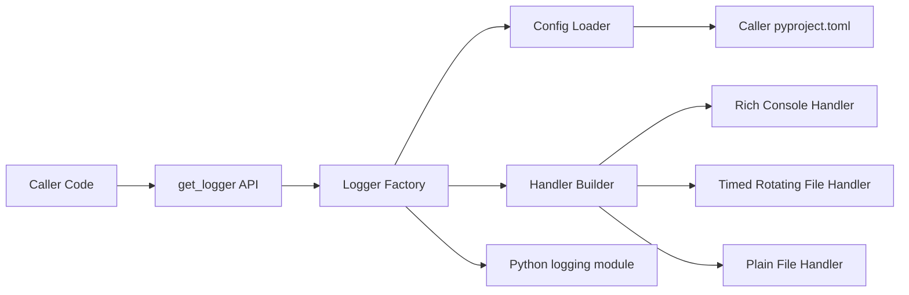
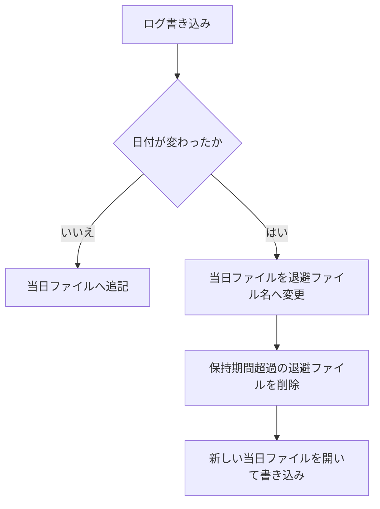
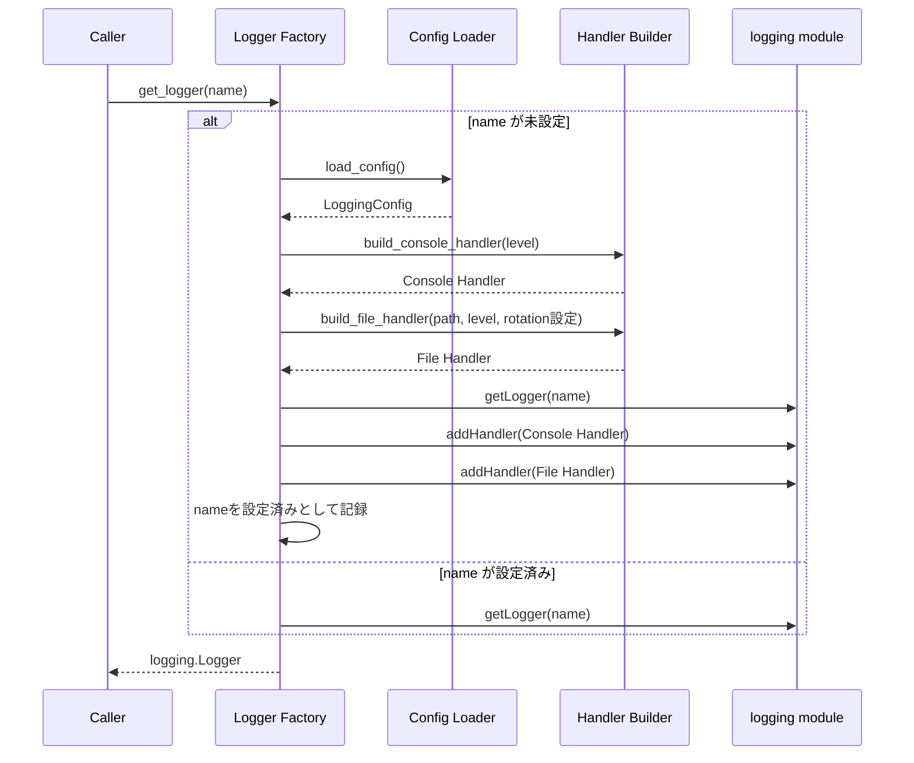

# Technical Design Document

## Overview

**Purpose**: 本機能は、`rich`をラップしたロギングユーティリティ（`get_logger`ファサード）を`python_util`パッケージの一機能として提供し、呼び出し側アプリケーションの開発者が整形されたコンソール出力とファイル出力を最小限のコードで得られるようにする。ファイル出力には日次ローテーションを既定で適用し、保持期間を超えた古いログを自動削除する。

**Users**: `python_util`を依存関係に持つ個人の複数プロジェクトの開発者（本人）が、各プロジェクトの`pyproject.toml`にロギング設定を記述するだけで、コード変更なしに出力先・ログレベル・ログ保持を制御する用途で利用する。

**Impact**: `src/python_util/logging/`サブパッケージは実装済み（types / config_loader / handlers / factory の4モジュール）。本改訂（Issue #7）では、ファイル用ハンドラを`logging.FileHandler`から`logging.handlers.TimedRotatingFileHandler`ベースへ差し替え、設定スキーマに`rotation`テーブルを追加する。**ローテーションは既定で有効となるため、既存利用箇所のファイル出力の観測可能な挙動が変わる**（退避ファイルの生成、保持期間超過分の削除）。

### Goals
- `rich`によるコンソール整形出力と、任意ファイルへのプレーンテキスト出力を同時に提供する
- 呼び出し側の`pyproject.toml`の`[tool.python_util.logging]`テーブルから、出力先ファイルパス・ログレベルを制御可能にする
- 複数モジュール/クラスにまたがる呼び出しでも、ログ出力先を単一ファイルに統合するか、ロガー名単位で個別ファイルに分離するかを設定で選択できるようにする
- ファイル出力に日次ローテーション（当日: `{名前}.log`、退避: `{名前}-{日付}.log`、既定7日保持）を既定で適用し、`pyproject.toml`で無効化・保持日数変更を可能にする

### Non-Goals
- サイズベースのローテーション（`RotatingFileHandler`相当）、日次以外のローテーション間隔（時間単位・週次等）
- 退避ファイル名規則のカスタマイズ、退避ログの圧縮・アーカイブ
- 外部ログ収集基盤（ELK, CloudWatch等）への送信・連携
- Python以外の言語・ランタイムからの利用
- 非同期（`asyncio`）コンテキストに最適化した専用ハンドラ

## Boundary Commitments

### This Spec Owns
- `get_logger(name: str | None = None) -> logging.Logger`という公開APIの契約
- `pyproject.toml`の`[tool.python_util.logging]`テーブルの設定スキーマ定義と解釈（`rotation`テーブルを含む）
- コンソール用（`RichHandler`）・ファイル用（`TimedRotatingFileHandler`/`FileHandler`）ハンドラの構築と、ロガーへのアタッチ方式
- 退避ファイルの命名規則（`{stem}-{YYYY-MM-DD}.log`）と保持期間管理（既定7日・世代削除）
- 同一プロセス内でのハンドラ重複登録防止の保証

### Out of Boundary
- ログメッセージの実際の呼び出し（`logger.info(...)`等）は呼び出し側コードの責務であり、本スペックは関与しない
- 退避ログの圧縮・アーカイブ、サイズベースのローテーション
- 複数プロセスが同一ログファイルへ同時に書き込む場合のローテーション競合の調停（標準ハンドラの保証範囲外）
- `pyproject.toml`以外の設定ソース（環境変数、CLI引数等）からの設定上書き
- 呼び出し側プロジェクトが複数の`pyproject.toml`を持つモノレポ構成での探索範囲の最適化

### Allowed Dependencies
- `rich`（`rich.logging.RichHandler`) — 既存のtech.mdで採用済み
- Python標準ライブラリ: `logging`, `logging.handlers`（`TimedRotatingFileHandler`）, `tomllib`（3.11+）, `pathlib`, `warnings`, `dataclasses`, `re`
- 呼び出し側の`pyproject.toml`ファイル（読み取り専用）

### Revalidation Triggers
- `[tool.python_util.logging]`のスキーマ（キー名・型・階層構造。`rotation.enabled`/`rotation.retention_days`を含む）を変更する場合
- 退避ファイルの命名規則（`{stem}-{YYYY-MM-DD}.log`）またはローテーション間隔（日次固定）を変更する場合
- `get_logger`のシグネチャまたは戻り値の型を変更する場合
- 設定探索アルゴリズム（カレントディレクトリ基点の上方探索）を変更する場合
- サポートするPythonバージョン下限（`>=3.11`、`tomllib`・namer対応`getFilesToDelete`依存）を変更する場合

## Architecture

### Existing Architecture Analysis
- 既存の依存方向（Types → Config Loader → Handler Builder → Logger Factory → 公開API）と4モジュール構成を維持する
- ローテーション対応は (1) `LoggingConfig`へのフィールド追加、(2) 設定解析の拡張、(3) `build_file_handler`の構築先ハンドラ差し替え、(4) Factoryからの引数受け渡し、のみで実現し、新規コンポーネント・新規モジュールは追加しない
- 設定エラーの「`warnings.warn` + デフォルト全体フォールバック」パターン（要件3.5の実装）をローテーション設定にも一貫して適用する

### Architecture Pattern & Boundary Map

**Architecture Integration**:
- 選定パターン: Facade + 標準`logging`ラップ（変更なし。詳細は`research.md`の Architecture Pattern Evaluation を参照）
- ドメイン境界: 「設定の読み込み（Config Loader）」「ハンドラの構築（Handler Builder）」「ロガーの取得・キャッシュ（Logger Factory）」の分離を維持。ローテーションの責務（命名・保持・発火契機）はHandler Builderに閉じる
- Build vs Adopt: 標準`TimedRotatingFileHandler` + `namer`関数を採用。サブクラス・自作ハンドラは不採用（Python 3.11+の`getFilesToDelete()`がnamer対応であることをソース確認・実機検証済み。`research.md`参照）
- Steering準拠: 標準ライブラリ中心・軽量実装というtech.mdの方針を維持し、追加の外部依存は導入しない



**依存方向**: Types → Config Loader → Handler Builder → Logger Factory → 公開API（`__init__.py`）。各層は左側のレイヤーのみに依存し、逆方向のインポートは行わない。

### Technology Stack

| Layer | Choice / Version | Role in Feature | Notes |
|-------|------------------|-----------------|-------|
| Console Output | `rich.logging.RichHandler`（`rich`既存採用バージョンに準拠） | コンソールへの整形済みログ出力 | フォーマッタは`"%(message)s"`のみとし、装飾は`RichHandler`に委譲（`research.md`参照） |
| Log Core | Python標準`logging`モジュール | ロガー・ハンドラのライフサイクル管理 | 標準APIと完全互換を維持 |
| File Output（ローテーション有効時・既定） | 標準`logging.handlers.TimedRotatingFileHandler`（`when="midnight"`, `backupCount=保持日数`, `encoding="utf-8"`） + カスタム`namer`関数 | 日次ローテーション付きファイル出力・世代削除 | `namer`は関数代入のみでサブクラス不要（Python 3.11+）。ANSI装飾を含まない専用`Formatter`を使用 |
| File Output（ローテーション無効時） | 標準`logging.FileHandler` | 単一ファイルへの追記出力 | 従来挙動。`rotation.enabled = false`時のみ |
| Config Parsing | 標準`tomllib`（Python 3.11+） | 呼び出し側`pyproject.toml`の解析 | 外部依存追加を避けるため`tomli`ではなく標準`tomllib`を採用し、`requires-python`を`>=3.11`とする |

## File Structure Plan

### Directory Structure
```
src/python_util/
└── logging/
    ├── __init__.py       # 公開API: get_logger のみをエクスポート（変更なし）
    ├── types.py          # LoggingConfig, LoggerOverride データクラス定義
    ├── config_loader.py  # pyproject.toml探索・解析 -> LoggingConfig
    ├── handlers.py       # RichHandler / ローテーション対応ファイルハンドラの構築とnamer関数
    └── factory.py        # get_logger実装、設定済みロガー名のレジストリ管理
tests/
└── logging/
    ├── test_config_loader.py  # rotation設定の解析・不正値フォールバックのテストを追加
    ├── test_handlers.py       # ローテーションハンドラ構築・命名規則・世代削除のテストを追加
    ├── test_factory.py        # ローテーション設定の受け渡しのテストを追加
    ├── test_fallback.py       # ローテーション不正値時の全体フォールバックのテストを追加
    └── test_integration.py    # 日付変更を模擬したE2Eローテーションのテストを追加
```

### Modified Files
- `src/python_util/logging/types.py` — `LoggingConfig`に`rotation_enabled: bool = True`・`retention_days: int = 7`フィールドを追加（6.1, 6.6, 7.1, 7.2）
- `src/python_util/logging/config_loader.py` — `[tool.python_util.logging.rotation]`テーブル（`enabled`/`retention_days`）の解析と検証を`_parse_logging_table`に追加（7.1, 7.2, 7.3）
- `src/python_util/logging/handlers.py` — `build_file_handler`をローテーション設定受け取りに拡張し、有効時は`TimedRotatingFileHandler` + `namer`、無効時は従来の`FileHandler`を構築。退避ファイル名を生成する`namer`関数を同モジュールに定義（6.2, 6.3, 6.4, 6.5, 7.1）
- `src/python_util/logging/factory.py` — `_configure_logger`が`LoggingConfig`のローテーション設定を`build_file_handler`へ受け渡す（6.7）
- `README.md` — ローテーションの既定有効化（挙動変更）と`rotation`設定スキーマを記載
- 新規ファイルなし

## System Flows

### ローテーション発火フロー（emit契機）



**フロー上の要点**:
- ローテーションは emit（ログ書き込み）を契機に判定・発火する。深夜0時に書き込みがなければ、翌日以降の最初の書き込み時にまとめて退避される（要件6.3）
- プロセス再起動をまたぐ場合も、`TimedRotatingFileHandler`が既存ファイルのmtimeを基点に次回ロールオーバー時刻を計算するため、前日以前のログは最初の書き込み時に正しく退避される（`research.md`の検証結果参照）
- 退避ファイル名の日付は「退避対象ログが記録された日」（終了するインターバルの開始日）から生成される（要件6.4）
- 判定はローカル時刻の深夜0時を境界とする（`utc=False`、標準の既定値）

### get_logger 呼び出しフロー



**フロー上の要点**:
- 「name が未設定」の判定はFactory内部のレジストリ（プロセス内メモリ上の集合）で行い、2回目以降の呼び出しではハンドラ構築をスキップする（要件4.3）
- `LoggingConfig`は初回ロード時にプロセス内でキャッシュし、以降の`get_logger`呼び出しでは再読込しない（呼び出しごとのファイルI/Oを避ける）
- ファイルハンドラは解決済み出力パス単位でキャッシュ・共有され、同一パスへの`build_file_handler`呼び出しは初回のみ実行される（Logger Factoryの責務参照）

## Requirements Traceability

| Requirement | Summary | Components | Interfaces | Flows |
|-------------|---------|------------|------------|-------|
| 1.1, 1.2, 1.4 | 名前指定/省略でのロガー取得、同名ロガーの再利用 | Logger Factory | `get_logger` | get_logger 呼び出しフロー |
| 1.3 | richによるコンソール整形出力 | Handler Builder | `build_console_handler` | get_logger 呼び出しフロー |
| 2.1, 2.3 | ファイルへの書き出し・追記 | Handler Builder | `build_file_handler` | get_logger 呼び出しフロー |
| 2.2 | 出力先ディレクトリの自動作成 | Handler Builder | `build_file_handler` | - |
| 2.4 | コンソール・ファイル同時出力 | Logger Factory | `get_logger` | get_logger 呼び出しフロー |
| 3.1, 3.2, 3.3, 3.4 | pyproject.tomlからの設定読込・適用・デフォルト | Config Loader | `load_config` | get_logger 呼び出しフロー |
| 3.5 | 不正設定時のエラー通知・フォールバック | Config Loader | `load_config` | - |
| 4.1, 4.2 | 出力先の一元化・個別制御 | Config Loader, Logger Factory | `LoggingConfig.loggers`, `get_logger` | - |
| 4.3 | ハンドラ重複登録の防止 | Logger Factory | `get_logger`（内部レジストリ） | get_logger 呼び出しフロー |
| 4.4 | 同名ロガー間での出力先設定共有 | Logger Factory | `get_logger` | get_logger 呼び出しフロー |
| 5.1, 5.2, 5.3 | 標準ログレベルのサポート・フィルタ・出力先別レベル | Handler Builder, Config Loader | `build_console_handler`, `build_file_handler`, `LoggingConfig` | - |
| 6.1 | ファイル出力時のローテーション既定有効 | Types, Logger Factory | `LoggingConfig.rotation_enabled`（既定`True`） | get_logger 呼び出しフロー |
| 6.2 | 当日ログを設定された出力先ファイルへ書き出す | Handler Builder | `build_file_handler` | ローテーション発火フロー |
| 6.3 | 日付変更後の最初の書き込みでローテーション | Handler Builder | `TimedRotatingFileHandler(when="midnight")` | ローテーション発火フロー |
| 6.4 | 退避ファイル名 `{名前}-{日付}.log`（YYYY-MM-DD） | Handler Builder | `namer`関数 | ローテーション発火フロー |
| 6.5, 6.6 | 保持期間超過分の削除・既定7日 | Handler Builder, Types | `backupCount`, `LoggingConfig.retention_days` | ローテーション発火フロー |
| 6.7 | ロガー個別ファイルにも同一ローテーション適用 | Logger Factory | `_configure_logger`から`build_file_handler`への受け渡し | get_logger 呼び出しフロー |
| 7.1 | 設定によるローテーション無効化 | Config Loader, Handler Builder | `rotation.enabled`, `build_file_handler` | - |
| 7.2 | 設定による保持日数の変更 | Config Loader, Types | `rotation.retention_days` | - |
| 7.3 | ローテーション設定不正時のフォールバック | Config Loader | `load_config` | - |

## Components and Interfaces

| Component | Domain/Layer | Intent | Req Coverage | Key Dependencies (P0/P1) | Contracts |
|-----------|--------------|--------|--------------|--------------------------|-----------|
| Types | Types | 設定値のデータ構造を定義 | 3.2, 3.3, 3.4, 4.1, 4.2, 5.1, 5.3, 6.1, 6.6, 7.2 | なし | State |
| Config Loader | Config | 呼び出し側pyproject.tomlの探索・解析 | 3.1-3.5, 4.1, 4.2, 7.1-7.3 | Types (P0) | Service |
| Handler Builder | Handler | コンソール/ファイル用ハンドラの構築（ローテーション含む） | 1.3, 2.1-2.4, 5.1-5.3, 6.2-6.5, 7.1 | Types (P0), rich (P0), logging.handlers (P0) | Service |
| Logger Factory | Facade | 公開API `get_logger` の実装、重複防止レジストリ管理 | 1.1, 1.2, 1.4, 2.4, 4.1-4.4, 6.1, 6.7 | Config Loader (P0), Handler Builder (P0) | Service |

### Types

#### LoggingConfig / LoggerOverride

| Field | Detail |
|-------|--------|
| Intent | ロギング設定の不変な値オブジェクトを定義する |
| Requirements | 3.2, 3.3, 3.4, 4.1, 4.2, 5.1, 5.3, 6.1, 6.6, 7.2 |

**Responsibilities & Constraints**
- `LoggingConfig`は`pyproject.toml`から解釈された設定全体を保持する不変（frozen）データクラスとする
- `LoggerOverride`はロガー名単位の個別設定（出力先ファイル・ログレベル）を表す。ローテーション設定はグローバルのみとし、ロガー単位の上書きは持たない（要件6.7: 個別ファイルにもグローバルのローテーション設定を適用）
- 両データクラスはPython型ヒントを必須とし、`Any`型を使用しない

**Contracts**: State [x]

##### State Management
- **State model**:
  - `LoggingConfig`: `default_level: int`, `console_enabled: bool`, `console_level: int | None`, `file_path: Path | None`, `file_level: int | None`, `rotation_enabled: bool = True`, `retention_days: int = 7`, `loggers: dict[str, LoggerOverride]`
  - `LoggerOverride`: `file_path: Path | None`, `level: int | None`, `console_level: int | None`
- **Persistence & consistency**: メモリ上のみで完結し、永続化は行わない。`Config Loader`が生成し、`Logger Factory`がプロセス内でキャッシュする
- **Concurrency strategy**: イミュータブル（frozen dataclass）とすることでスレッド間共有時の競合を防ぐ

### Config

#### Config Loader

| Field | Detail |
|-------|--------|
| Intent | カレントディレクトリ基点で`pyproject.toml`を探索し、`[tool.python_util.logging]`を`LoggingConfig`へ変換する |
| Requirements | 3.1, 3.2, 3.3, 3.4, 3.5, 4.1, 4.2, 7.1, 7.2, 7.3 |

**Responsibilities & Constraints**
- カレントワーキングディレクトリから親方向へ`pyproject.toml`が見つかるまで探索する（`research.md`のDesign Decision参照）。最初に見つかったファイルのみを採用し、それ以上は遡らない
- `[tool.python_util.logging]`テーブルが存在しない場合はデフォルト値の`LoggingConfig`を返す（要件3.4。ローテーション有効・保持7日を含む）
- `rotation`テーブルを解析する: `enabled`はbool（既定`true`）、`retention_days`は正の整数（既定`7`）。`retention_days`にbool値・0以下・非整数が指定された場合は不正値として扱う（Pythonでは`bool`が`int`のサブクラスであるため明示的に排除する）
- TOML構文エラーまたはスキーマ上不正な値（未知のログレベル文字列、不正なローテーション設定値等）を検出した場合は`warnings.warn`で通知し、デフォルト設定にフォールバックする（要件3.5, 7.3）。例外を送出しない。フォールバックは既存パターンと同一の設定全体フォールバックとし、結果として既定のローテーション設定（有効・保持7日間）が適用される
- `loggers.<name>`はロガー名に対する前方一致（ドット区切りの階層プレフィックス一致）で解決する。複数のエントリが同時に一致する場合は最も具体的な（最長の）一致を優先する。一致するエントリがない場合はグローバル設定（`level`, `file`等）を適用する

**Dependencies**
- Inbound: Logger Factory — 初回`get_logger`呼び出し時に設定取得のため呼び出す (P0)
- External: `tomllib`（標準ライブラリ） — TOML解析のため (P0)

**Contracts**: Service [x]

##### Service Interface
```python
def load_config(start_dir: Path | None = None) -> LoggingConfig: ...
```
- Preconditions: `start_dir`は存在するディレクトリのパス、または`None`（`None`の場合は`Path.cwd()`を基点とする）
- Postconditions: 常に有効な`LoggingConfig`を返す。ファイル不在・解析失敗時も例外を送出せずデフォルト値で返す。返り値の`retention_days`は常に正の整数
- Invariants: 同一ディレクトリ構成・同一ファイル内容に対しては同一の`LoggingConfig`を返す（参照透過）

### Handler

#### Handler Builder

| Field | Detail |
|-------|--------|
| Intent | `LoggingConfig`からコンソール用・ファイル用（ローテーション対応）の`logging.Handler`を構築する |
| Requirements | 1.3, 2.1, 2.2, 2.3, 2.4, 5.1, 5.2, 5.3, 6.2, 6.3, 6.4, 6.5, 7.1 |

**Responsibilities & Constraints**
- コンソール用ハンドラは`rich.logging.RichHandler`を`"%(message)s"`フォーマッタとともに構築する
- ファイル用ハンドラは、ローテーション有効時（既定）は`logging.handlers.TimedRotatingFileHandler(when="midnight", backupCount=retention_days, encoding="utf-8")`を構築し、`namer`属性に退避ファイル名生成関数を代入する。無効時は従来どおり`logging.FileHandler`（追記モード）を構築する（要件7.1）
- `namer`関数は標準ハンドラが渡すデフォルト名`{設定ファイルパス}.{YYYY-MM-DD}`を`{stem}-{YYYY-MM-DD}{拡張子}`へ変換する（例: `app.log.2026-07-13` → `app-2026-07-13.log`）。日付部分は**デフォルト名の末尾サフィックス（最後のドット以降）**を用いる。設定ファイル名自体に日付形式の文字列が含まれる場合（例: `run-2026-07-01.log`）でも誤抽出しないことを保証する（要件6.4）
- 保持期間管理は`backupCount`（ファイル数ベース）に委譲する。日次ローテーションでは毎日書き込みがあればファイル数＝日数と等価。書き込みのない日を挟むとカレンダー日数では設定値より長く残るが許容とする（`research.md`のDesign Decision参照）
- いずれのハンドラも時刻・レベル・ロガー名・メッセージを含むプレーンな`Formatter`を使用する
- ファイル用ハンドラ構築時、出力先ディレクトリが存在しなければ作成する。作成に失敗した場合（権限不足等）は`warnings.warn`で警告を発した上でファイルハンドラを構築せずコンソール出力のみにフォールバックする（例外は送出しない）
- 各ハンドラは独立したログレベルしきい値を設定できる（要件5.3）

**Dependencies**
- Inbound: Logger Factory — ハンドラ取得のため呼び出す (P0)
- External: `rich.logging.RichHandler` (P0)、`logging.handlers.TimedRotatingFileHandler`（標準ライブラリ） (P0)

**Contracts**: Service [x]

##### Service Interface
```python
def build_console_handler(level: int) -> logging.Handler: ...
def build_file_handler(
    path: Path,
    level: int,
    *,
    rotation_enabled: bool = True,
    retention_days: int = 7,
) -> logging.Handler | None: ...
```
- Preconditions: `level`は`logging`モジュール標準のレベル定数（`DEBUG`〜`CRITICAL`）、`path`は書き込み可能なファイルパス、`retention_days`は正の整数
- Postconditions: 設定済みハンドラを返す。`rotation_enabled=True`の場合は日次ローテーション・世代削除が有効なハンドラを返す。`build_file_handler`呼び出し後は親ディレクトリが存在することが保証される。ディレクトリ作成に失敗した場合は`None`を返し、呼び出し側（Logger Factory）はコンソール出力のみで継続する
- Invariants: 同一引数に対し副作用（ディレクトリ作成）を除き同等の設定を持つハンドラを返す。ローテーション判定・退避・削除はemit契機でハンドラ内部が行い、Builderは構築時設定のみに責任を持つ

### Facade

#### Logger Factory

| Field | Detail |
|-------|--------|
| Intent | 公開API `get_logger` を実装し、設定読込・ハンドラ構築・重複防止を統括する |
| Requirements | 1.1, 1.2, 1.4, 2.4, 4.1, 4.2, 4.3, 4.4, 6.1, 6.7 |

**Responsibilities & Constraints**
- ロガー名が初回リクエストの場合のみ、`Config Loader`から設定を取得し（プロセス内でキャッシュ）、該当ロガー名に適用すべき出力先（グローバル設定 or `loggers`テーブルの個別上書き、最長一致優先）を解決し、ハンドラを構築・登録する
- ファイルハンドラ構築時、`LoggingConfig`の`rotation_enabled`・`retention_days`をそのまま`build_file_handler`へ受け渡す。グローバルの`file`とロガー個別の`loggers.<name>.file`のどちらに対しても同一のローテーション設定を適用する（要件6.1, 6.7）
- **ファイルハンドラは解決済み出力パスをキーとするプロセス内キャッシュで共有し、1つの出力パスにつき1ハンドラインスタンスのみを構築する**。複数のロガー名が同一ファイルへ統合される構成（要件4.1）では、全ロガーに同一のハンドラインスタンスをアタッチする。同一パスに複数の`TimedRotatingFileHandler`インスタンスが載ると、ローテーション実行後に後続インスタンスのストリームが退避済みファイルを指し続け当日ログが前日の退避ファイルへ混入するため（実機検証済み、`research.md`参照）、この共有は正しさの要件である
- 2回目以降の同名リクエストでは、レジストリを参照して既存の`logging.Logger`をそのまま返す（ハンドラを再登録しない）
- レジストリの「名前が設定済みか」の判定とハンドラ登録は`threading.Lock`で保護し、単一のcheck-and-set操作として扱う（要件4.3）
- 登録済みロガーは`propagate = False`とし、ルートロガー経由の二重出力を防ぐ

**Dependencies**
- Inbound: 呼び出し側コード全般 — ロガー取得のため呼び出す (P0)
- Outbound: Config Loader — 設定取得 (P0)、Handler Builder — ハンドラ構築 (P0)

**Contracts**: Service [x]

##### Service Interface
```python
def get_logger(name: str | None = None) -> logging.Logger: ...
```
- Preconditions: `name`は`None`または非空文字列
- Postconditions: 設定済みの`logging.Logger`を返す。同名での再呼び出しは同一の設定（ハンドラ構成）を持つロガーを返し、ハンドラを重複登録しない
- Invariants: プロセス内で一度設定されたロガー名は、プロセス終了まで設定状態を保持する

**Implementation Notes**
- Integration: `__init__.py`から`get_logger`のみを再エクスポートし、`types.py`/`config_loader.py`/`handlers.py`/`factory.py`の内部実装は非公開とする
- Validation: `name`が空文字列の場合はデフォルト名解決ロジック（呼び出し元モジュール名）にフォールバックする
- Risks: 標準`logging`モジュールのグローバル状態に依存するため、テスト時は各テストケース間でレジストリ・パス単位ハンドラキャッシュ・`logging.Logger`のハンドラ状態を明示的にリセットする必要がある（既存の`_reset_registry`を拡張してハンドラキャッシュも破棄する。Testing Strategy参照）

## Data Models

### Domain Model
- **値オブジェクト**: `LoggingConfig`（呼び出し側プロジェクト全体のロギング設定。ローテーション設定を含む）と`LoggerOverride`（ロガー名単位の個別設定）
- **不変条件**: `LoggerOverride`が指定されていないロガー名は、`LoggingConfig`のグローバル設定（`file_path`, `default_level`等）を継承する。ローテーション設定（`rotation_enabled`, `retention_days`）は常にグローバル値がすべてのファイルハンドラに適用される

### Data Contracts & Integration

**pyproject.toml 設定スキーマ**（`[tool.python_util.logging]`）

| キー | 型 | 必須 | 説明 |
|------|-----|------|------|
| `level` | string（`DEBUG`/`INFO`/`WARNING`/`ERROR`/`CRITICAL`） | 任意（既定値: `INFO`） | 全体のデフォルトログレベル |
| `file` | string（パス） | 任意（既定値: なし＝ファイル出力無効） | 全ロガー共通の出力先ログファイル |
| `console.enabled` | bool | 任意（既定値: `true`） | コンソール出力の有効/無効 |
| `console.level` | string | 任意（既定値: `level`を継承） | コンソール出力専用のログレベル |
| `file_level` | string | 任意（既定値: `level`を継承） | ファイル出力専用のログレベル |
| `rotation.enabled` | bool | 任意（既定値: `true`） | 日次ローテーションの有効/無効 |
| `rotation.retention_days` | integer（正の整数） | 任意（既定値: `7`） | 退避ファイルの保持世代数（日次ローテーションのためファイル数≒日数。書き込みのない日を挟むとカレンダー日数では設定値より長く残る） |
| `loggers.<name>.file` | string（パス） | 任意 | 指定ロガー名（前方一致、最長一致優先）専用の出力先ファイル |
| `loggers.<name>.level` | string | 任意 | 指定ロガー名専用のログレベル |

- **退避ファイル命名規則**: 設定された出力先が`app.log`の場合、当日は`app.log`、退避ファイルは`app-2026-07-13.log`（`{stem}-{YYYY-MM-DD}{拡張子}`、日付は退避対象ログが記録された日）となる
- **スキーマバージョニング**: 現時点でバージョンフィールドは設けず、キー追加のみで後方互換を保つ方針とする（`research.md`のRisks参照）
- **不正値の扱い**: 未知のログレベル文字列、TOML構文エラー、不正なローテーション設定値（`retention_days`が正の整数でない等）はConfig Loaderが検出しデフォルトへフォールバックする（要件3.5, 7.3）

## Error Handling

### Error Strategy
設定関連のエラーは「デフォルト設定へのフォールバック＋警告通知」で処理し、呼び出し側アプリケーションの起動を妨げない方針とする（ロギング基盤自体の障害でアプリケーション全体を止めないため）。

### Error Categories and Responses
- **設定エラー**（TOML構文エラー、未知のログレベル文字列、不正なローテーション設定値）: `Config Loader`が`warnings.warn`で通知し、デフォルトの`LoggingConfig`にフォールバックする（要件3.5, 7.3）。フォールバック後はローテーション有効・保持7日間の既定動作となる
- **ファイルシステムエラー**（出力先ディレクトリ作成不可等）: `Handler Builder`が`warnings.warn`で通知し、ファイルハンドラを構築せずコンソール出力のみにフォールバックする。例外は送出しない
- **ローテーション実行時のOSエラー**（退避ファイルのリネーム・削除失敗）: 標準`logging`のエラーハンドリング（`Handler.handleError`）に委譲し、アプリケーションを停止させない

### Monitoring
本機能自体の稼働監視は対象外（Out of Boundary）。設定フォールバック発生時の`warnings.warn`が唯一の可観測性シグナルとなる。

## Testing Strategy

> 時刻依存のローテーションテストは、ハンドラの`rolloverAt`属性を過去時刻に設定してからemitすることで、時刻モックなしに決定的に発火させる（`research.md`の検証結果参照）。

- **Unit Tests**:
  - Config Loader: 正常な`[tool.python_util.logging]`の解析、テーブル不在時のデフォルト値返却（ローテーション有効・7日を含む）、TOML構文エラー時のフォールバックと警告発火、`rotation.enabled`/`rotation.retention_days`の解析、`retention_days`不正値（0、負数、bool、文字列）でのフォールバックと警告、`loggers.<name>`個別設定のマージと最長一致優先
  - Handler Builder: `build_console_handler`が`RichHandler`を返すこと、ローテーション有効時に`TimedRotatingFileHandler`（`when="midnight"`, `backupCount=retention_days`, UTF-8）が構築されること、`rotation_enabled=False`で従来の`FileHandler`が構築されること、`namer`が`app.log.2026-07-13`形式を`app-2026-07-13.log`へ変換すること、存在しないディレクトリの作成、作成失敗時の`None`返却と警告
  - Logger Factory: 同名再呼び出しでハンドラを重複登録しないこと、名前省略時に呼び出し元モジュール名が使われること、`LoggingConfig`のローテーション設定が`build_file_handler`へ受け渡されること、**同一出力パスを指す複数ロガーが単一のファイルハンドラインスタンスを共有すること（パス単位キャッシュ）**、スレッド並行時の排他制御、`_reset_registry`がパス単位ハンドラキャッシュも破棄すること
- **Integration Tests**:
  - 一時ディレクトリの`pyproject.toml`を用意し、`get_logger`経由で書き出したログファイルの内容・レベルフィルタが期待通りであること
  - `rolloverAt`を過去に設定した状態でemitし、当日ファイルが`{stem}-{日付}.log`へ退避され新しい当日ファイルへ書き込みが継続されること（要件6.2, 6.3, 6.4）
  - **複数のモジュールが単一ファイル統合構成で`get_logger`を取得した状態で日付変更を模擬し、ローテーション後も全ロガーのログが新しい当日ファイルへ書き込まれること（退避済みファイルへの混入がないこと）**（要件4.1, 6.2, 6.3）
  - 保持世代数を超える退避ファイルを事前配置した状態でローテーションを発火させ、古いファイルが削除されること（要件6.5, 6.6）
  - `rotation.enabled = false`の設定でローテーション・削除が発生せず単一ファイルへ追記され続けること（要件7.1）
  - `loggers.<name>.file`によるロガー個別ファイルでも同一のローテーション動作が適用されること（要件6.7）
  - ファイル出力先ディレクトリの作成に失敗する環境（権限不足を模擬）で、警告発行後もコンソール出力のみで動作が継続すること

## Migration Strategy

- **挙動変更**: 本改訂によりファイル出力のローテーションが既定で有効になる。既存利用プロジェクトでは、更新後の初回書き込み時に前日以前のログが退避され、以降は保持期間（7日）超過分が削除される
- **従来挙動の維持方法**: `pyproject.toml`に`rotation.enabled = false`を設定することで従来の単一ファイル追記に戻せる
- **周知**: README.mdに挙動変更・設定スキーマ・オプトアウト方法を明記する（タスクに含める）
- ロールバックはパッケージバージョンの切り戻しで対応可能（データ移行を伴わないため特別な手順は不要）

## Optional Sections
本機能は認証・機密データ処理・高負荷処理を伴わないため、Security ConsiderationsおよびPerformance & Scalabilityの専用セクションは省略する（ベースラインはsteering文書に準拠）。
