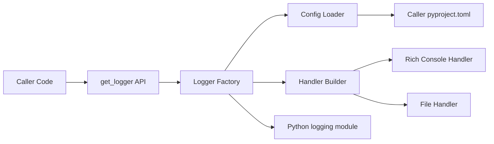
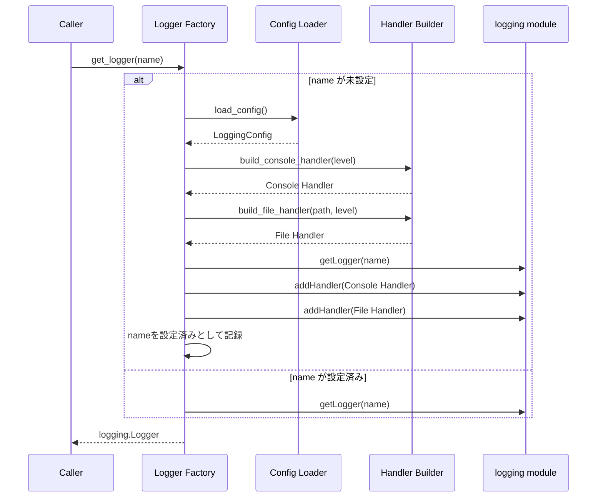

# Technical Design Document

## Overview

**Purpose**: 本機能は、`rich`をラップしたロギングユーティリティ（`get_logger`ファサード）を`python_util`パッケージの一機能として提供し、呼び出し側アプリケーションの開発者が整形されたコンソール出力とファイル出力を最小限のコードで得られるようにする。

**Users**: `python_util`を依存関係に持つ個人の複数プロジェクトの開発者（本人）が、各プロジェクトの`pyproject.toml`にロギング設定を記述するだけで、コード変更なしに出力先・ログレベルを制御する用途で利用する。

**Impact**: 現時点で`python_util`にロギング機能は存在しない（グリーンフィールド）。本機能により`src/python_util/logging/`配下に新規サブパッケージを追加する。

### Goals
- `rich`によるコンソール整形出力と、任意ファイルへのプレーンテキスト出力を同時に提供する
- 呼び出し側の`pyproject.toml`の`[tool.python_util.logging]`テーブルから、出力先ファイルパス・ログレベルを制御可能にする
- 複数モジュール/クラスにまたがる呼び出しでも、ログ出力先を単一ファイルに統合するか、ロガー名単位で個別ファイルに分離するかを設定で選択できるようにする

### Non-Goals
- ログファイルのサイズ・世代管理を伴うローテーション機能（`RotatingFileHandler`相当の高度な制御）
- 外部ログ収集基盤（ELK, CloudWatch等）への送信・連携
- Python以外の言語・ランタイムからの利用
- 非同期（`asyncio`）コンテキストに最適化した専用ハンドラ

## Boundary Commitments

### This Spec Owns
- `get_logger(name: str | None = None) -> logging.Logger`という公開APIの契約
- `pyproject.toml`の`[tool.python_util.logging]`テーブルの設定スキーマ定義と解釈
- コンソール用（`RichHandler`）・ファイル用（`FileHandler`）ハンドラの構築と、ロガーへのアタッチ方式
- 同一プロセス内でのハンドラ重複登録防止の保証

### Out of Boundary
- ログメッセージの実際の呼び出し（`logger.info(...)`等）は呼び出し側コードの責務であり、本スペックは関与しない
- ログファイルのローテーション・圧縮・保持期間管理
- `pyproject.toml`以外の設定ソース（環境変数、CLI引数等）からの設定上書き
- 呼び出し側プロジェクトが複数の`pyproject.toml`を持つモノレポ構成での探索範囲の最適化

### Allowed Dependencies
- `rich`（`rich.logging.RichHandler`) — 既存のtech.mdで採用済み
- Python標準ライブラリ: `logging`, `tomllib`（3.11+）, `pathlib`, `warnings`, `dataclasses`
- 呼び出し側の`pyproject.toml`ファイル（読み取り専用）

### Revalidation Triggers
- `[tool.python_util.logging]`のスキーマ（キー名・型・階層構造）を変更する場合
- `get_logger`のシグネチャまたは戻り値の型を変更する場合
- 設定探索アルゴリズム（カレントディレクトリ基点の上方探索）を変更する場合
- サポートするPythonバージョン下限（`>=3.11`、`tomllib`依存）を変更する場合

## Architecture

### Architecture Pattern & Boundary Map

**Architecture Integration**:
- 選定パターン: Facade + 標準`logging`ラップ（詳細は`research.md`の Architecture Pattern Evaluation を参照）
- ドメイン境界: 「設定の読み込み（Config Loader）」「ハンドラの構築（Handler Builder）」「ロガーの取得・キャッシュ（Logger Factory）」を分離し、それぞれが単一責任を持つ
- 既存パターンの踏襲: 標準ライブラリ中心・軽量実装というtech.mdの方針を維持し、追加の外部依存は導入しない
- 新規コンポーネントの理由: 設定読込・ハンドラ構築・ファクトリを分離することで、それぞれを独立にテスト可能にし、将来の設定ソース追加（Out of Boundaryだが拡張点として）にも備える
- Steering準拠: `src/python_util/`配下への機能別モジュール分割（structure.mdの方針）に従うが、単一ファイル`logging.py`ではなく`logging/`サブパッケージとする。理由は下記Technology Stackおよびディレクトリ構成に記載



**依存方向**: Types → Config Loader → Handler Builder → Logger Factory → 公開API（`__init__.py`）。各層は左側のレイヤーのみに依存し、逆方向のインポートは行わない。

### Technology Stack

| Layer | Choice / Version | Role in Feature | Notes |
|-------|------------------|-----------------|-------|
| Console Output | `rich.logging.RichHandler`（`rich`既存採用バージョンに準拠） | コンソールへの整形済みログ出力 | フォーマッタは`"%(message)s"`のみとし、装飾は`RichHandler`に委譲（`research.md`参照） |
| Log Core | Python標準`logging`モジュール | ロガー・ハンドラのライフサイクル管理 | 標準APIと完全互換を維持 |
| File Output | 標準`logging.FileHandler` | ファイルへのプレーンテキスト出力 | ANSI装飾を含まない専用`Formatter`を使用 |
| Config Parsing | 標準`tomllib`（Python 3.11+） | 呼び出し側`pyproject.toml`の解析 | 外部依存追加を避けるため`tomli`ではなく標準`tomllib`を採用し、`requires-python`を`>=3.11`とする |

## File Structure Plan

### Directory Structure
```
src/python_util/
└── logging/
    ├── __init__.py       # 公開API: get_logger のみをエクスポート
    ├── types.py          # LoggingConfig, LoggerOverride データクラス定義
    ├── config_loader.py  # pyproject.toml探索・解析 -> LoggingConfig
    ├── handlers.py       # RichHandler/FileHandlerの構築
    └── factory.py        # get_logger実装、設定済みロガー名のレジストリ管理
tests/
└── logging/
    ├── test_config_loader.py
    ├── test_handlers.py
    └── test_factory.py
```

> steering(`structure.md`)の例では単一ファイル`logging.py`を挙げているが、設定解析・ハンドラ構築・ファクトリという3つの異なる責務が存在するため、本設計では機能別分割の原則に従い`logging/`サブパッケージとする。`tests/`は`src/python_util/`の構成をミラーリングする方針を維持する。

### Modified Files
なし（グリーンフィールドのため新規追加のみ）。`pyproject.toml`の`requires-python`を`>=3.11`に、`dependencies`に`rich`を追加する必要がある（既存tech.mdで採用済みのため実質的な変更は最小）。

## System Flows

### get_logger 呼び出しフロー



**フロー上の要点**:
- 「name が未設定」の判定はFactory内部のレジストリ（プロセス内メモリ上の集合）で行い、2回目以降の呼び出しではハンドラ構築をスキップする（要件4.3）
- `LoggingConfig`は初回ロード時にプロセス内でキャッシュし、以降の`get_logger`呼び出しでは再読込しない（呼び出しごとのファイルI/Oを避ける）

## Requirements Traceability

| Requirement | Summary | Components | Interfaces | Flows |
|-------------|---------|------------|------------|-------|
| 1.1, 1.2, 1.4 | 名前指定/省略でのロガー取得、同名ロガーの再利用 | Logger Factory | `get_logger` | get_logger 呼び出しフロー |
| 1.3 | richによるコンソール整形出力 | Handler Builder | `build_console_handler` | get_logger 呼び出しフロー |
| 2.1, 2.3 | ファイルへの書き出し・追記 | Handler Builder | `build_file_handler` | get_logger 呼び出しフロー |
| 2.2 | 出力先ディレクトリの自動作成 | Handler Builder | `build_file_handler` | - |
| 2.4 | コンソール・ファイル同時出力 | Logger Factory | `get_logger` | get_logger 呼び出しフロー |
| 3.1, 3.2, 3.3, 3.4 | pyproject.tomlからの設定読込・適用・デフォルト | Config Loader | `load_config` | get_logger 呼び出しフロー |
| 3.5 | 不正設定時のエラー通知・フォールバック | Config Loader | `load_config` | - |
| 4.1, 4.2 | 出力先の一元化・個別制御 | Config Loader, Logger Factory | `LoggingConfig.loggers`, `get_logger` | - |
| 4.3 | ハンドラ重複登録の防止 | Logger Factory | `get_logger`（内部レジストリ） | get_logger 呼び出しフロー |
| 4.4 | 同名ロガー間での出力先設定共有 | Logger Factory | `get_logger` | get_logger 呼び出しフロー |
| 5.1, 5.2, 5.3 | 標準ログレベルのサポート・フィルタ・出力先別レベル | Handler Builder, Config Loader | `build_console_handler`, `build_file_handler`, `LoggingConfig` | - |

## Components and Interfaces

| Component | Domain/Layer | Intent | Req Coverage | Key Dependencies (P0/P1) | Contracts |
|-----------|--------------|--------|--------------|--------------------------|-----------|
| Types | Types | 設定値のデータ構造を定義 | 3.2, 3.3, 3.4, 4.1, 4.2, 5.1, 5.3 | なし | State |
| Config Loader | Config | 呼び出し側pyproject.tomlの探索・解析 | 3.1-3.5, 4.1, 4.2 | Types (P0) | Service |
| Handler Builder | Handler | コンソール/ファイル用ハンドラの構築 | 1.3, 2.1-2.4, 5.1-5.3 | Types (P0), rich (P0) | Service |
| Logger Factory | Facade | 公開API `get_logger` の実装、重複防止レジストリ管理 | 1.1, 1.2, 1.4, 2.4, 4.1-4.4 | Config Loader (P0), Handler Builder (P0) | Service |

### Types

#### LoggingConfig / LoggerOverride

| Field | Detail |
|-------|--------|
| Intent | ロギング設定の不変な値オブジェクトを定義する |
| Requirements | 3.2, 3.3, 3.4, 4.1, 4.2, 5.1, 5.3 |

**Responsibilities & Constraints**
- `LoggingConfig`は`pyproject.toml`から解釈された設定全体を保持する不変（frozen）データクラスとする
- `LoggerOverride`はロガー名単位の個別設定（出力先ファイル・ログレベル）を表す
- 両データクラスはPython型ヒントを必須とし、`Any`型を使用しない

**Contracts**: State [x]

##### State Management
- **State model**:
  - `LoggingConfig`: `default_level: int`, `console_enabled: bool`, `console_level: int | None`, `file_path: Path | None`, `file_level: int | None`, `loggers: dict[str, LoggerOverride]`
  - `LoggerOverride`: `file_path: Path | None`, `level: int | None`, `console_level: int | None`
- **Persistence & consistency**: メモリ上のみで完結し、永続化は行わない。`Config Loader`が生成し、`Logger Factory`がプロセス内でキャッシュする
- **Concurrency strategy**: イミュータブル（frozen dataclass）とすることでスレッド間共有時の競合を防ぐ

### Config

#### Config Loader

| Field | Detail |
|-------|--------|
| Intent | カレントディレクトリ基点で`pyproject.toml`を探索し、`[tool.python_util.logging]`を`LoggingConfig`へ変換する |
| Requirements | 3.1, 3.2, 3.3, 3.4, 3.5, 4.1, 4.2 |

**Responsibilities & Constraints**
- カレントワーキングディレクトリから親方向へ`pyproject.toml`が見つかるまで探索する（`research.md`のDesign Decision参照）。最初に見つかったファイルのみを採用し、それ以上は遡らない
- `[tool.python_util.logging]`テーブルが存在しない場合はデフォルト値の`LoggingConfig`を返す（要件3.4）
- TOML構文エラーまたはスキーマ上不正な値（未知のログレベル文字列等）を検出した場合は`warnings.warn`で通知し、デフォルト設定にフォールバックする（要件3.5）。例外を送出しない
- `loggers.<name>`はロガー名に対する前方一致（ドット区切りの階層プレフィックス一致）で解決する。複数のエントリが同時に一致する場合（例: `myapp`と`myapp.worker`の双方が設定されており、対象ロガー名が`myapp.worker.io`である場合）は、**最も具体的な（最長の）一致を優先する**。一致するエントリがない場合はグローバル設定（`level`, `file`等）を適用する

**Dependencies**
- Inbound: Logger Factory — 初回`get_logger`呼び出し時に設定取得のため呼び出す (P0)
- External: `tomllib`（標準ライブラリ） — TOML解析のため (P0)

**Contracts**: Service [x]

##### Service Interface
```python
def load_config(start_dir: Path | None = None) -> LoggingConfig: ...
```
- Preconditions: `start_dir`は存在するディレクトリのパス、または`None`（`None`の場合は`Path.cwd()`を基点とする）
- Postconditions: 常に有効な`LoggingConfig`を返す。ファイル不在・解析失敗時も例外を送出せずデフォルト値で返す
- Invariants: 同一ディレクトリ構成・同一ファイル内容に対しては同一の`LoggingConfig`を返す（参照透過）

### Handler

#### Handler Builder

| Field | Detail |
|-------|--------|
| Intent | `LoggingConfig`からコンソール用・ファイル用の`logging.Handler`を構築する |
| Requirements | 1.3, 2.1, 2.2, 2.3, 2.4, 5.1, 5.2, 5.3 |

**Responsibilities & Constraints**
- コンソール用ハンドラは`rich.logging.RichHandler`を`"%(message)s"`フォーマッタとともに構築する
- ファイル用ハンドラは`logging.FileHandler`（追記モード）を、時刻・レベル・ロガー名・メッセージを含むプレーンな`Formatter`とともに構築する
- ファイル用ハンドラ構築時、出力先ディレクトリが存在しなければ作成する（`Path.mkdir(parents=True, exist_ok=True)`相当の責務）
- 出力先ディレクトリの作成に失敗した場合（権限不足等）は、`warnings.warn`で警告を発した上でファイルハンドラを構築せずコンソール出力のみにフォールバックする（例外は送出しない）
- 各ハンドラは独立したログレベルしきい値を設定できる（要件5.3）

**Dependencies**
- Inbound: Logger Factory — ハンドラ取得のため呼び出す (P0)
- External: `rich.logging.RichHandler` (P0)

**Contracts**: Service [x]

##### Service Interface
```python
def build_console_handler(level: int) -> logging.Handler: ...
def build_file_handler(path: Path, level: int) -> logging.Handler | None: ...
```
- Preconditions: `level`は`logging`モジュール標準のレベル定数（`DEBUG`〜`CRITICAL`）、`path`は書き込み可能なファイルパス
- Postconditions: 設定済みハンドラを返す。`build_file_handler`呼び出し後は親ディレクトリが存在することが保証される。ディレクトリ作成に失敗した場合は`None`を返し、呼び出し側（Logger Factory）はコンソール出力のみで継続する
- Invariants: 同一引数に対し副作用（ディレクトリ作成）を除き同等の設定を持つハンドラを返す

### Facade

#### Logger Factory

| Field | Detail |
|-------|--------|
| Intent | 公開API `get_logger` を実装し、設定読込・ハンドラ構築・重複防止を統括する |
| Requirements | 1.1, 1.2, 1.4, 2.4, 4.1, 4.2, 4.3, 4.4 |

**Responsibilities & Constraints**
- ロガー名が初回リクエストの場合のみ、`Config Loader`から設定を取得し（プロセス内でキャッシュ）、該当ロガー名に適用すべき出力先（グローバル設定 or `loggers`テーブルの個別上書き、最長一致優先）を解決し、ハンドラを構築・登録する
- 2回目以降の同名リクエストでは、レジストリを参照して既存の`logging.Logger`をそのまま返す（ハンドラを再登録しない）
- レジストリの「名前が設定済みか」の判定とハンドラ登録は`threading.Lock`で保護し、単一のcheck-and-set操作として扱う。これにより複数スレッドから同時に同名ロガーが初回リクエストされた場合でもハンドラの重複登録を防ぐ（要件4.3）
- 登録済みロガーは`propagate = False`とし、ルートロガー経由の二重出力を防ぐ

**Dependencies**
- Inbound: 呼び出し側コード全般 — ロガー取得のため呼び出す (P0)
- Outbound: Config Loader — 設定取得 (P0)、Handler Builder — ハンドラ構築 (P0)

**Contracts**: Service [x]

##### Service Interface
```python
def get_logger(name: str | None = None) -> logging.Logger: ...
```
- Preconditions: `name`は`None`または非空文字列
- Postconditions: 設定済みの`logging.Logger`を返す。同名での再呼び出しは同一の設定（ハンドラ構成）を持つロガーを返し、ハンドラを重複登録しない
- Invariants: プロセス内で一度設定されたロガー名は、プロセス終了まで設定状態を保持する

**Implementation Notes**
- Integration: `__init__.py`から`get_logger`のみを再エクスポートし、`types.py`/`config_loader.py`/`handlers.py`/`factory.py`の内部実装は非公開とする
- Validation: `name`が空文字列の場合はデフォルト名解決ロジック（呼び出し元モジュール名）にフォールバックする
- Risks: 標準`logging`モジュールのグローバル状態に依存するため、テスト時は各テストケース間でレジストリと`logging.Logger`のハンドラ状態を明示的にリセットする必要がある（Testing Strategy参照）

## Data Models

### Domain Model
- **値オブジェクト**: `LoggingConfig`（呼び出し側プロジェクト全体のロギング設定）と`LoggerOverride`（ロガー名単位の個別設定）
- **不変条件**: `LoggerOverride`が指定されていないロガー名は、`LoggingConfig`のグローバル設定（`file_path`, `default_level`等）を継承する

### Data Contracts & Integration

**pyproject.toml 設定スキーマ**（`[tool.python_util.logging]`）

| キー | 型 | 必須 | 説明 |
|------|-----|------|------|
| `level` | string（`DEBUG`/`INFO`/`WARNING`/`ERROR`/`CRITICAL`） | 任意（既定値: `INFO`） | 全体のデフォルトログレベル |
| `file` | string（パス） | 任意（既定値: なし＝ファイル出力無効） | 全ロガー共通の出力先ログファイル |
| `console.enabled` | bool | 任意（既定値: `true`） | コンソール出力の有効/無効 |
| `console.level` | string | 任意（既定値: `level`を継承） | コンソール出力専用のログレベル |
| `file_level` | string | 任意（既定値: `level`を継承） | ファイル出力専用のログレベル |
| `loggers.<name>.file` | string（パス） | 任意 | 指定ロガー名（前方一致、最長一致優先）専用の出力先ファイル |
| `loggers.<name>.level` | string | 任意 | 指定ロガー名専用のログレベル |

- **スキーマバージョニング**: 現時点でバージョンフィールドは設けず、キー追加のみで後方互換を保つ方針とする（`research.md`のRisks参照）
- **不正値の扱い**: 未知のログレベル文字列、TOML構文エラーはConfig Loaderが検出しデフォルトへフォールバックする（要件3.5）

## Error Handling

### Error Strategy
設定関連のエラーは「デフォルト設定へのフォールバック＋警告通知」で処理し、呼び出し側アプリケーションの起動を妨げない方針とする（ロギング基盤自体の障害でアプリケーション全体を止めないため）。

### Error Categories and Responses
- **設定エラー**（TOML構文エラー、未知のログレベル文字列、スキーマ不正）: `Config Loader`が`warnings.warn`で通知し、デフォルトの`LoggingConfig`にフォールバックする（要件3.5）
- **ファイルシステムエラー**（出力先ディレクトリ作成不可等）: `Handler Builder`が`warnings.warn`で通知し、ファイルハンドラを構築せずコンソール出力のみにフォールバックする。ロギング基盤自体の不備で呼び出し側アプリケーション全体を停止させないため、例外は送出しない（Error Strategyと同一方針に統一）

### Monitoring
本機能自体の稼働監視は対象外（Out of Boundary）。設定フォールバック発生時の`warnings.warn`が唯一の可観測性シグナルとなる。

## Testing Strategy

- **Unit Tests**:
  - Config Loader: 正常な`[tool.python_util.logging]`の解析、テーブル不在時のデフォルト値返却、TOML構文エラー時のフォールバックと警告発火、`loggers.<name>`個別設定のマージ、階層的に複数のオーバーライドが一致する場合に最長一致が優先されること
  - Handler Builder: `build_console_handler`が`RichHandler`を返すこと、`build_file_handler`が存在しないディレクトリを作成すること、指定レベルがハンドラに反映されること、出力先ディレクトリの作成に失敗した場合に`None`を返し警告を発すること
  - Logger Factory: 同名での再呼び出しがハンドラを重複登録しないこと、名前省略時に呼び出し元モジュール名が使われること、複数スレッドから同時に同名の未設定ロガーを要求してもハンドラが1組しか登録されないこと（`threading.Lock`による排他制御の検証）
- **Integration Tests**:
  - 実際に一時ディレクトリの`pyproject.toml`を用意し、`get_logger`経由で書き出したログファイルの内容・レベルフィルタが期待通りであること
  - 複数モジュールが同一ロガー名/異なるロガー名で`get_logger`を呼び出した際、単一ファイル統合と個別ファイル分離の双方が設定通りに動作すること
  - コンソール出力とファイル出力を同時に有効化した場合に両方へ出力されること
  - ファイル出力先ディレクトリの作成に失敗する環境（権限不足を模擬）で、警告発行後もコンソール出力のみで動作が継続すること

## Optional Sections
本機能は認証・機密データ処理・高負荷処理を伴わないため、Security ConsiderationsおよびPerformance & Scalabilityの専用セクションは省略する（ベースラインはsteering文書に準拠）。
</content>
