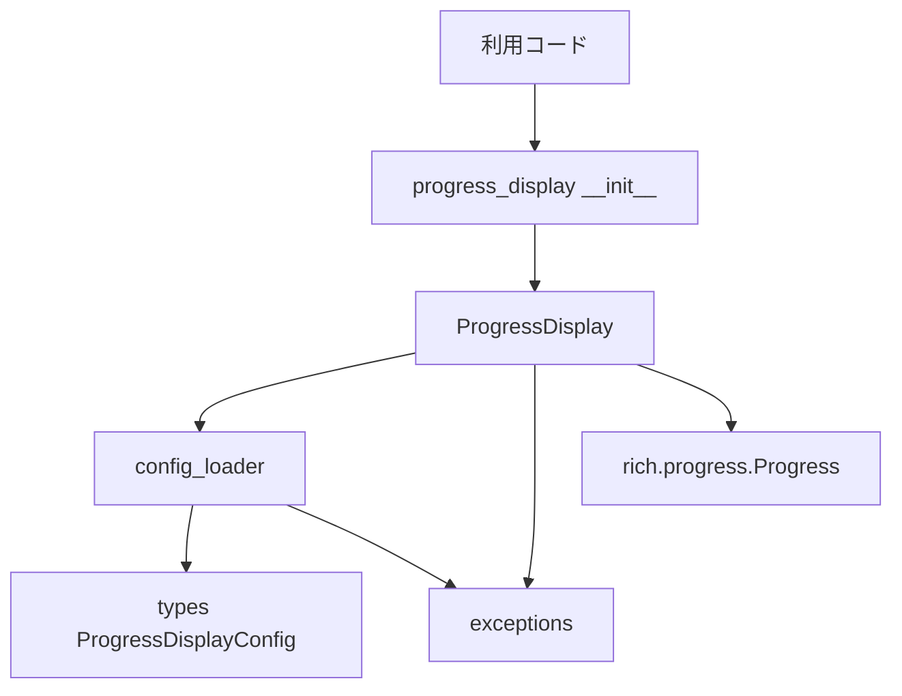
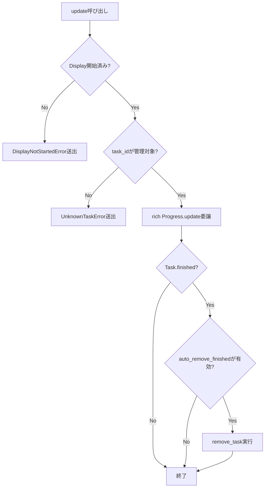

# Design Document

## Overview

**Purpose**: 本機能は、`rich.progress.Progress` の薄いラッパーである `ProgressDisplay` を `python_util.progress_display` サブパッケージとして提供し、複数の進捗タスクを単一のコンソール表示領域にまとめて管理・表示できるようにする。
**Users**: `python_util` を利用する個人プロジェクトの開発者が、バッチ処理やCLIツールに複数タスクの進捗表示を最小限のコードで組み込む際に利用する。
**Impact**: 新規サブパッケージの追加のみであり、既存の `logging` / `time_utility` サブパッケージの公開APIや挙動には影響しない。

### Goals
- 複数の進捗タスクを単一の `ProgressDisplay` インスタンスで一元管理し、同時に表示する
- コンテキストマネージャとイテラブル向けヘルパーにより、最小限のコードで進捗表示を組み込めるようにする
- `logging` サブパッケージと同一の `pyproject.toml` 設定オーバーライド規約に従う

### Non-Goals
- マルチプロセス/マルチスレッド間での進捗集約（Boundary Context 参照）
- 進捗履歴の永続化・ログファイルへの記録
- `rich.progress.Progress` 自体の再実装・置き換え

## Boundary Commitments

### This Spec Owns
- `ProgressDisplay` クラスおよびそのライフサイクル（開始/終了、タスクの追加・更新・削除）
- `[tool.python_util.progress_display]` 設定テーブルの読み込みとデフォルト値へのフォールバック
- `progress_display.exceptions` に定義される公開例外（`UnknownTaskError`, `InvalidTotalError`, `DisplayNotStartedError`）

### Out of Boundary
- `rich.progress.Progress` 本体のレンダリングロジック・列（Column）実装
- 複数プロセス/スレッドにまたがる進捗状態の同期
- ログ出力との統合（`logging` サブパッケージの責務）

### Allowed Dependencies
- `rich.progress`（`Progress`, `TaskID`, 各種 `ProgressColumn`）— 既存のコア技術（`tech.md`）
- 標準ライブラリ（`tomllib`, `pathlib`, `warnings`）
- `logging` サブパッケージの `config_loader.py` に確立された探索・フォールバックパターン（コードの直接依存はしないが、実装パターンとして踏襲）

### Revalidation Triggers
- `[tool.python_util.progress_display]` テーブルのスキーマ変更
- `ProgressDisplay` の公開メソッドシグネチャ変更（`add_task` / `update` / `remove_task` / `track`）
- `rich` の破壊的バージョンアップに伴う `Progress` APIの変更

## Architecture

### Architecture Pattern & Boundary Map



**Architecture Integration**:
- Selected pattern: 単一責務の薄いファサード（Facade）。`ProgressDisplay` が `rich.progress.Progress` を内部に1つ保持し、タスク管理APIをそのまま委譲する
- Domain/feature boundaries: 設定読み込み（`config_loader.py`）、型定義（`types.py`）、例外（`exceptions.py`）、表示ロジック（`display.py`）を責務ごとに分離
- Existing patterns preserved: `logging` サブパッケージの `pyproject.toml` 探索・`warnings.warn` フォールバック・`__init__.py` での公開API限定を踏襲
- New components rationale: `ProgressDisplay` は既存サブパッケージに同種のものがないため新設。`config_loader.py` / `types.py` / `exceptions.py` は `logging` と同一責務分割を再利用
- Steering compliance: 標準ライブラリ中心・外部依存最小化（`rich` のみ）、型ヒント必須、公開関数への日本語一行docstring
- Dependency Direction: `types` → `exceptions` → `config_loader` → `display` → `__init__`。各層は左側の層のみをimportし、逆方向のimport（例: `types.py`から`display.py`への依存）は行わない

### Technology Stack

| Layer | Choice / Version | Role in Feature | Notes |
|-------|------------------|-----------------|-------|
| コンソール表示 | `rich.progress.Progress`（プロジェクト既存依存） | 複数タスクの進捗レンダリング本体 | `ProgressDisplay` が内部で1インスタンス保持 |
| 設定読み込み | 標準ライブラリ `tomllib` + `pathlib` | `pyproject.toml` の探索・解析 | `logging/config_loader.py` と同一実装パターン |
| 型定義 | 標準ライブラリ `dataclasses` | `ProgressDisplayConfig` の定義 | `logging/types.py` と同様の構成 |

## File Structure Plan

### Directory Structure
```
src/python_util/progress_display/
├── __init__.py        # 公開API: ProgressDisplay, ProgressDisplayConfig, TaskID re-export, 例外クラス
├── types.py            # ProgressDisplayConfig（dataclass）
├── exceptions.py        # UnknownTaskError, InvalidTotalError, DisplayNotStartedError, _InvalidProgressDisplayConfig（内部）
├── config_loader.py     # pyproject.toml 探索・解析（logging/config_loader.py と同一パターン）
└── display.py            # ProgressDisplay 本体（rich.progress.Progress ラッパー）

tests/progress_display/
├── __init__.py
├── test_config_loader.py
├── test_display.py
└── test_exceptions.py
```

### Modified Files
- `README.md` — `progress_display` サブパッケージの使い方セクションを追加（Task分解の最終ステップとして実施）

> `config_loader.py` の探索アルゴリズムとフォールバック規約は `logging/config_loader.py`（変更なし）と同一だが、テーブル名・型が異なるため独立したモジュールとして新設する。

## System Flows

### タスク更新〜完了〜自動非表示のフロー



- `add_task` も同様に `Started` チェックと `total <= 0` の場合の `InvalidTotalError` 送出を行う（図は簡略化のため省略）。加えて `add_task` は追加直後にも `CheckFinished` 以降と同じ完了判定・自動非表示チェックを行う（`completed >= total` を指定して追加された場合に対応するため）
- 完了検知は独自の状態機械を持たず、`rich.progress.Task.finished` プロパティを都度参照する（[[progress-display]] research.md の Design Decisions 参照）

## Requirements Traceability

| Requirement | Summary | Components | Interfaces | Flows |
|-------------|---------|------------|------------|-------|
| 1.1 | タスク追加時に一意な識別子を発行 | ProgressDisplay | `add_task()` | タスク更新フロー |
| 1.2 | 複数タスクを単一表示領域に同時表示 | ProgressDisplay | `rich.progress.Progress`委譲 | - |
| 1.3 | 進捗更新を即座に反映 | ProgressDisplay | `update()` | タスク更新フロー |
| 1.4 | 説明文・現在値・総量を関連付けて表示 | ProgressDisplay | `add_task()`, `update()` | - |
| 1.5 | 未知のタスクIDへの操作で例外送出 | ProgressDisplay, exceptions | `UnknownTaskError` | タスク更新フロー |
| 2.1 | コンテキストマネージャで開始/終了 | ProgressDisplay | `__enter__`/`__exit__` | - |
| 2.2 | イテラブル向け進捗自動更新ヘルパー | ProgressDisplay | `track()` | - |
| 2.3 | richの主要表示要素を利用可能にする | ProgressDisplay | `__init__(*columns)` | - |
| 2.4 | 未開始状態での操作に例外送出 | ProgressDisplay, exceptions | `DisplayNotStartedError` | タスク更新フロー |
| 3.1 | タスク追加時にtotal/completedを指定可能 | ProgressDisplay | `add_task()` | - |
| 3.2 | 絶対値/相対増分の両方をサポート | ProgressDisplay | `update()` | タスク更新フロー |
| 3.3 | 現在値が総量到達で完了状態に遷移 | ProgressDisplay | `update()`（`Task.finished`参照） | タスク更新フロー |
| 3.4 | タスクの明示的削除 | ProgressDisplay | `remove_task()` | - |
| 3.5 | total不正値で例外送出 | ProgressDisplay, exceptions | `InvalidTotalError` | - |
| 3.6 | 完了タスクの自動非表示（設定時） | ProgressDisplay, types | `update()`, `ProgressDisplayConfig.auto_remove_finished` | タスク更新フロー |
| 4.1 | pyproject.tomlのテーブルを読み込み反映 | config_loader | `load_config()` | - |
| 4.2 | 自動非表示の有効/無効を設定可能 | types, config_loader | `ProgressDisplayConfig.auto_remove_finished` | - |
| 4.3 | 更新頻度を設定可能 | types, config_loader | `ProgressDisplayConfig.refresh_per_second` | - |
| 4.4 | 解析失敗時に警告しデフォルトへフォールバック | config_loader | `load_config()` | - |
| 4.5 | テーブル不在時はデフォルト設定で動作 | config_loader | `load_config()` | - |
| 5.1 | 不正な型でTypeError送出 | ProgressDisplay | 全公開メソッド | - |
| 5.2 | 値エラーは専用例外（ValueError継承） | exceptions | `UnknownTaskError`, `InvalidTotalError`, `DisplayNotStartedError` | - |
| 5.3 | 例外発生時も表示領域を正しくクリーンアップ | ProgressDisplay | `__exit__` | - |

## Components and Interfaces

| Component | Domain/Layer | Intent | Req Coverage | Key Dependencies (P0/P1) | Contracts |
|-----------|--------------|--------|--------------|--------------------------|-----------|
| ProgressDisplay | display.py | 複数タスクの進捗管理・表示のファサード | 1, 2, 3, 5 | rich.progress.Progress (P0), exceptions (P0), types (P1) | State |
| config_loader | config_loader.py | pyproject.tomlからの設定読み込み | 4 | types (P0), exceptions (P1: 内部例外) | Batch |
| ProgressDisplayConfig | types.py | 設定値のデータクラス | 4 | なし | State |
| exceptions | exceptions.py | 公開/内部例外の定義 | 1.5, 2.4, 3.5, 4.4, 5.2 | なし | - |

### 表示・管理レイヤー (display.py)

#### ProgressDisplay

| Field | Detail |
|-------|--------|
| Intent | `rich.progress.Progress` を内部に保持し、複数タスクの追加・更新・削除・表示をコンテキストマネージャとして提供する |
| Requirements | 1.1, 1.2, 1.3, 1.4, 1.5, 2.1, 2.2, 2.3, 2.4, 3.1, 3.2, 3.3, 3.4, 3.5, 3.6, 5.1, 5.2, 5.3 |

**Responsibilities & Constraints**
- 単一の `rich.progress.Progress` インスタンスのライフサイクル（`start`/`stop`）をコンテキストマネージャで管理する
- タスクの追加・更新・削除要求を `rich.progress.Progress` に委譲し、管理対象外の `TaskID` に対する操作は `UnknownTaskError` を送出する
- 未開始（`__enter__` 未呼び出し）状態でのタスク操作は `DisplayNotStartedError` を送出する
- `total <= 0` を指定した `add_task` は `InvalidTotalError` を送出する
- `auto_remove_finished` が有効な場合、`update()` 実行後に対象タスクが `finished` であれば `remove_task` を実行する

**Dependencies**
- Inbound: 利用コード（呼び出し側スクリプト） — 進捗表示の起動・更新 (P0)
- Outbound: `rich.progress.Progress` — 実際のレンダリング・タスク管理 (P0)
- Outbound: `progress_display.exceptions` — 例外送出 (P0)
- Outbound: `progress_display.types.ProgressDisplayConfig` — 挙動設定の参照 (P1)

**Contracts**: Service [x] / API [ ] / Event [ ] / Batch [ ] / State [x]

##### Service Interface
```python
class ProgressDisplay:
    def __init__(
        self,
        *columns: str | ProgressColumn,
        config: ProgressDisplayConfig | None = None,
        console: Console | None = None,
    ) -> None: ...

    def __enter__(self) -> ProgressDisplay: ...
    def __exit__(self, exc_type, exc_value, traceback) -> None: ...

    def add_task(
        self,
        description: str,
        *,
        total: float = 100.0,
        completed: float = 0.0,
    ) -> TaskID: ...

    def update(
        self,
        task_id: TaskID,
        *,
        completed: float | None = None,
        advance: float | None = None,
        description: str | None = None,
    ) -> None: ...

    def remove_task(self, task_id: TaskID) -> None: ...

    def track(
        self,
        sequence: Iterable[ProgressType],
        *,
        description: str = "Working...",
        total: float | None = None,
    ) -> Iterator[ProgressType]: ...
```
- Preconditions: `add_task`/`update`/`remove_task`/`track` は `__enter__` 済み（表示開始済み）でなければならない
- Postconditions: `add_task` は常に一意な `TaskID` を返す。`add_task` 時点で `completed >= total` の場合を含め、`add_task`/`update` いずれの経路でもタスクが完了状態（`Task.finished`）に至った直後に `auto_remove_finished` 判定を実行し、有効なら表示から即座に除去する
- Invariants: `ProgressDisplay` が管理する `TaskID` の集合は、`add_task` で追加され `remove_task` または自動除去で取り除かれたものと常に一致する

##### State Management
- State model: 内部状態は `rich.progress.Progress` が保持するタスクテーブルに委譲し、`ProgressDisplay` 自身は開始/未開始のフラグと `ProgressDisplayConfig` のみを保持する
- Persistence & consistency: プロセス内メモリのみ。永続化なし
- Concurrency strategy: シングルスレッド利用を前提とし、並行アクセスの排他制御は行わない（Non-Goals参照）

**Implementation Notes**
- Integration: `__init__` に渡した `*columns` は `rich.progress.Progress` にそのまま渡し、指定がなければ `rich` のデフォルト列構成を使う
- Validation: `add_task` の `total` は呼び出し時に検証し、`update` の `advance`/`completed` は `rich` 側の検証に委譲する（`rich` が `TypeError` 相当を送出しない不正型は呼び出し時点で `TypeError` を送出する）
- Risks: `rich.progress.Progress` の将来のAPI変更が本コンポーネントに直接影響する（Revalidation Triggers参照）

### 設定レイヤー (config_loader.py / types.py)

#### config_loader

| Field | Detail |
|-------|--------|
| Intent | 呼び出し側 `pyproject.toml` の `[tool.python_util.progress_display]` テーブルを探索・解析し `ProgressDisplayConfig` を構築する |
| Requirements | 4.1, 4.2, 4.3, 4.4, 4.5 |

**Responsibilities & Constraints**
- `logging/config_loader.py` と同一の探索アルゴリズム（呼び出しディレクトリから親方向に `pyproject.toml` を探索）を用いる
- テーブル不在・TOML解析失敗・値検証失敗のいずれも例外を外部に伝播させず、`warnings.warn` で警告し `ProgressDisplayConfig()` のデフォルト値にフォールバックする
- 値検証失敗は内部例外 `_InvalidProgressDisplayConfig` で表現し、`load_config` 内で捕捉する

**Dependencies**
- Inbound: `ProgressDisplay.__init__`（`config` 未指定時） — デフォルト設定の解決 (P1)
- Outbound: `progress_display.types.ProgressDisplayConfig` — 戻り値の構築 (P0)

**Contracts**: Service [x] / API [ ] / Event [ ] / Batch [x] / State [ ]

##### Service Interface
```python
def load_config(start_dir: Path | None = None) -> ProgressDisplayConfig: ...
```
- Preconditions: なし（`start_dir` 省略時は `Path.cwd()` を用いる）
- Postconditions: 常に有効な `ProgressDisplayConfig` を返す（例外を送出しない）
- Invariants: 戻り値はテーブル不在・解析失敗時は必ずデフォルト値と一致する

##### Batch / Job Contract
- Trigger: `ProgressDisplay` 初期化時（`config` 未指定の場合）に同期的に1回実行
- Input / validation: `pyproject.toml` の `[tool.python_util.progress_display]` テーブル（`auto_remove_finished: bool`, `refresh_per_second: float`）
- Output / destination: `ProgressDisplayConfig` インスタンス
- Idempotency & recovery: 呼び出しの都度ファイルを再読み込みする純粋関数。失敗時は警告＋デフォルト値へのフォールバックで自己回復する

**Implementation Notes**
- Integration: `logging/config_loader.py` の `_find_pyproject_toml` と同一ロジックを `progress_display` 内に独立実装する（サブパッケージ間の直接依存を避けるため、research.md の Design Decisions を参照）
- Validation: `refresh_per_second` に0以下の値が指定された場合は `_InvalidProgressDisplayConfig` を送出し `load_config` で捕捉、警告してデフォルト値にフォールバックする
- Risks: なし

#### ProgressDisplayConfig

| Field | Detail |
|-------|--------|
| Intent | `progress_display` の挙動設定を保持する不変データクラス |
| Requirements | 4.2, 4.3 |

**Responsibilities & Constraints**
- `auto_remove_finished: bool = False`（3.6の既定値。デフォルトで無効）
- `refresh_per_second: float = 10.0`（`rich.progress.Progress(refresh_per_second=...)` にそのまま渡す）

**Contracts**: Service [ ] / API [ ] / Event [ ] / Batch [ ] / State [x]

##### State Management
- State model: `@dataclass(frozen=True)` によるイミュータブルな値オブジェクト
- Persistence & consistency: なし（プロセス内の設定値保持のみ）
- Concurrency strategy: イミュータブルであるため並行読み取りは安全

### 例外レイヤー (exceptions.py)

| 例外 | 継承 | 公開/内部 | 用途 |
|------|------|-----------|------|
| `UnknownTaskError` | `ValueError` | 公開 | 管理対象外の `TaskID` への操作（1.5） |
| `InvalidTotalError` | `ValueError` | 公開 | `total <= 0` の指定（3.5） |
| `DisplayNotStartedError` | `ValueError` | 公開 | 未開始状態でのタスク操作（2.4） |
| `_InvalidProgressDisplayConfig` | `Exception` | 内部 | 設定テーブルの値検証失敗（`config_loader` 内でのみ使用、4.4） |

## Data Models

### Logical Data Model

**Structure Definition**:
- `ProgressDisplayConfig`: `auto_remove_finished: bool`, `refresh_per_second: float` の2属性のみを持つイミュータブルな値オブジェクト。永続化対象ではなくプロセス内設定
- タスク自体のデータモデル（説明文・総量・現在値）は `rich.progress.Task` にそのまま委譲し、本サブパッケージは独自のタスクエンティティを持たない（Design Decisions参照）

**Consistency & Integrity**:
- `ProgressDisplayConfig` は不変のため、生成後の状態変化は発生しない
- タスクの整合性（`TaskID` の集合）は `rich.progress.Progress` が単一の真実源として保持する

## Error Handling

### Error Strategy
`TypeError`（型不正）と `ValueError` 継承の専用例外（値不正）を明確に分離する。設定読み込みは例外を外部に伝播させず警告＋フォールバックで自己回復する。

### Error Categories and Responses
- **型不正**: `add_task`/`update`/`remove_task`/`track` に不正な型（例: `task_id` に `TaskID` 以外の型）が渡された場合 → `TypeError` を送出
- **値不正（タスク操作）**: 未知の `TaskID` → `UnknownTaskError`。未開始状態での操作 → `DisplayNotStartedError`。不正な `total` → `InvalidTotalError`
- **値不正（設定）**: `pyproject.toml` のテーブル解析・値検証失敗 → 内部例外 `_InvalidProgressDisplayConfig` を `config_loader.load_config` 内で捕捉し `warnings.warn` してデフォルト値にフォールバック（5.3, 4.4）
- **クリーンアップ保証**: `ProgressDisplay.__exit__` は例外の有無にかかわらず `rich.progress.Progress.stop()` を呼び出し、表示領域を正しく終了させる（5.3）

## Testing Strategy

- **Unit Tests**:
  - `config_loader.load_config`: テーブルなし/正常値/型不正値/TOML解析失敗の4パターンでデフォルトフォールバックと警告発火を検証
  - `ProgressDisplay.add_task`: `total <= 0` で `InvalidTotalError`、正常系で一意な `TaskID` 発行を検証
  - `ProgressDisplay.update`: 未知の `TaskID` で `UnknownTaskError`、未開始状態で `DisplayNotStartedError`、`advance`/`completed` 双方の指定を検証
  - `ProgressDisplay.remove_task`: 管理対象タスクの明示的な除去、および未知の `TaskID` 指定時の `UnknownTaskError` を検証
  - `ProgressDisplay` 各公開メソッド: `task_id`/`total`/`description` 等に不正な型を渡した場合に `TypeError` が送出されることを検証
- **Integration Tests**:
  - コンテキストマネージャ内で複数タスクを追加・更新し、`auto_remove_finished=True` 設定時に完了タスクが表示から除去されることを確認
  - `track()` でイテラブルを消費しながら進捗が自動更新されることを確認
  - ブロック内で例外を送出しても `__exit__` で表示が正しく終了することを確認（5.3）

## Supporting References (Optional)
- 詳細な調査ログ・設計判断の背景は [`research.md`](./research.md) を参照
