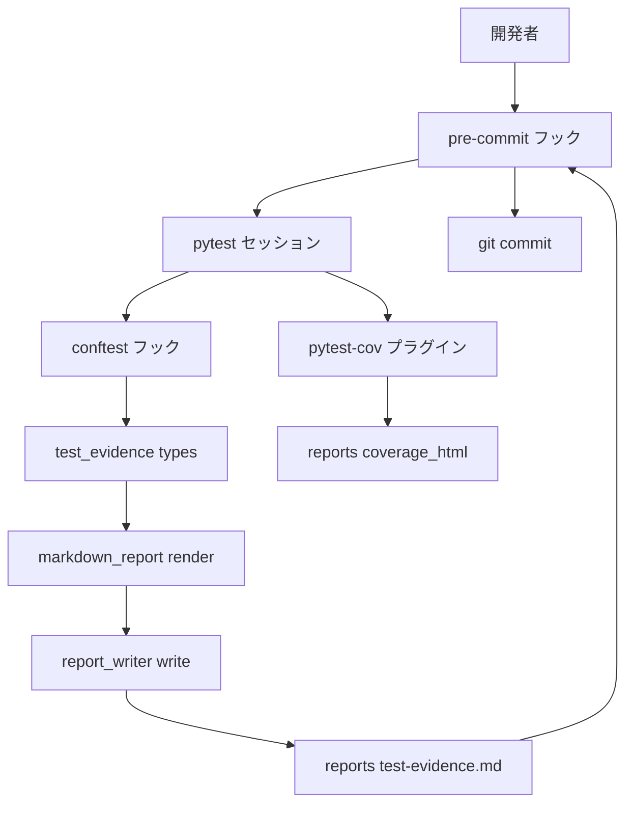
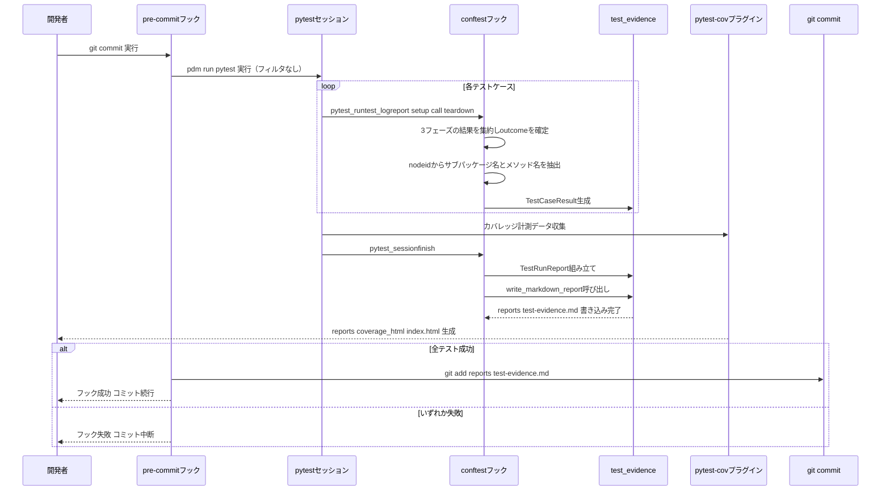

# Design Document

## Overview

**Purpose**: 本機能は、(1) pytestテストメソッド名を日本語で記述するための命名規則を定義して既存テストへ適用し、(2) テスト実行結果を第三者が確認できるエビデンス（Markdownレポート + HTMLカバレッジレポート）として自動出力する仕組みを `python_util` に導入する。
**Users**: `python_util` リポジトリの開発者（本人）が、日々の実装作業およびレビュー時にテストの意図を素早く把握し、テスト実施の証跡を残すために利用する。
**Impact**: 新規サブパッケージ `python_util.test_evidence` の追加、リポジトリルートへの `conftest.py` 新設、既存4サブパッケージ（`logging`, `time_utility`, `binary_string_codec`, `progress_display`）配下の既存テストメソッド名の改修、および `pyproject.toml` へのカバレッジ計測設定追加を伴う。既存サブパッケージの公開APIや実装ロジックへの影響はない。

### Goals
- テストメソッド名から目的・対象・状態・期待結果を日本語で読み取れる命名規則を定義し、`test_` プレフィックスによるpytest収集規約と両立させる
- 既存4サブパッケージの全テストメソッド名を、ロジックを変えずに日本語命名規則へ改修する
- `pdm run pytest` 実行のみでMarkdown形式のテスト結果レポートとHTML形式のカバレッジレポートが自動生成される状態にする

### Non-Goals
- 日本語命名規則の構文的な自動検証（lintルール化）は対象外。パターンは「最低限の構成」であり厳密な自動チェックは行わない
- `.kiro/steering/` への恒久的なルール反映（本仕様の実装完了後、別途 `/kiro:steering` 系コマンドで対応）
- CI/CDパイプライン（GitHub Actions等のリモート実行基盤）へのエビデンス出力の自動組み込み・成果物の外部送付。本仕様が導入するのはローカルのGitコミットフックのみ
- `coverage.py` / `pytest-cov` 自体の計測ロジックの再実装

## Boundary Commitments

### This Spec Owns
- `python_util.test_evidence` サブパッケージ（`TestOutcome` / `TestCaseResult` / `TestRunReport` の型定義、Markdownレンダリング、レポートファイル書き込み）
- リポジトリルートの `conftest.py` によるpytestフック統合（テスト結果収集からエビデンス出力までの配線）
- `pyproject.toml` のカバレッジ計測設定（`pytest-cov` の導入・`addopts`）
- `.pre-commit-config.yaml` によるコミット前フルスイート強制実行とエビデンスのコミット同梱
- 日本語テストメソッド命名規則の定義と、既存4サブパッケージの既存テストへの適用

### Out of Boundary
- `coverage.py` / `pytest-cov` 本体の計測アルゴリズム・HTML描画ロジック
- `.kiro/steering/` ファイルへの命名規則・エビデンス運用ルールの反映（要件4.2、本仕様完了後の別作業）
- CI/CDパイプライン（GitHub Actions等のリモート実行基盤）へのテスト実行・エビデンス公開の自動化
- 他プロジェクトへのpytestプラグインとしての配布・パッケージ化
- `pre-commit` フック未インストール状態での強制（`pdm run pre-commit install` の実行はREADME記載のうえで開発者の手動セットアップに委ねる）

### Allowed Dependencies
- `pytest`（既存の `dependency-groups.test` 依存、`>=9.1.1`）
- 新規dev依存: `pytest-cov>=7.1.0`（`coverage>=7.10.6` を内部で要求、Python `>=3.9` 対応で本プロジェクトの `>=3.11` と両立）
- 新規dev依存: `pre-commit>=4.6.0`（Python `>=3.10` 対応で本プロジェクトの `>=3.11` と両立。`repo: local` / `language: system` フックとして使用し、`pre-commit` 自体は個別言語環境を構築しない）
- 標準ライブラリ: `dataclasses`, `enum`, `pathlib`, `datetime`
- 既存サブパッケージ（`logging`, `time_utility`, `binary_string_codec`, `progress_display`）の構成パターン（`types.py` / `exceptions.py` / `__init__.py` の分離）を実装パターンとして踏襲（コードの直接依存はしない）

### Revalidation Triggers
- pytestの内部フックAPI（`pytest_runtest_logreport` / `pytest_sessionstart` / `pytest_sessionfinish`）の破壊的変更
- `tests/<subpackage>/...` というディレクトリ構成の変更（サブパッケージ抽出ロジックが依存している）
- 日本語命名規則の基本パターン（`test_(テスト目的)_(テスト対象)が_(状態)だった場合_(想定される結果)`）の変更
- `pytest-cov` のメジャーバージョンアップに伴うオプション仕様変更
- `pre-commit` のフック定義仕様（`repo: local` / `language: system`）の破壊的変更

## Architecture

### Architecture Pattern & Boundary Map



**Architecture Integration**:
- Selected pattern: 収集（Collector）とレンダリング（Renderer）を分離した薄いパイプラインを、コミット前ゲート（`pre-commit`）が包む構成。pytestフック（`conftest.py`）が生データを収集し、`test_evidence` サブパッケージの型・純粋関数がドメインオブジェクトへの変換とMarkdown描画・書き込みを担う。`pre-commit` フックはフルスイート実行の強制と、成功時のみのステージング（`git add`）を担う
- Domain/feature boundaries: pytest内部API（`TestReport`等）への依存は `conftest.py` に閉じ込め、`test_evidence` サブパッケージは `pytest` に依存しない純粋なドメイン層とする。`pre-commit` によるコミットゲート制御は `.pre-commit-config.yaml` に閉じ込め、`test_evidence` / `conftest.py` はコミットフローの存在を意識しない
- Existing patterns preserved: 既存サブパッケージと同一の `types.py` / `exceptions.py` / `__init__.py` 分離、公開APIの `__all__` 限定、専用例外は `ValueError` 継承
- New components rationale: `test_evidence` は既存サブパッケージに同種のものがないため新設。`conftest.py` はリポジトリ固有のテスト実行フローを配線する役割であり、`src/python_util/` 配下の公開ライブラリコードとは責務が異なるためルート直下に分離。`.pre-commit-config.yaml` はコミット前ゲートという別種の関心事のため独立したファイルとする
- Steering compliance: 標準ライブラリ中心・外部依存最小化（新規依存は `pytest-cov` と `pre-commit` の2つに限定）、型ヒント必須、公開関数への日本語一行docstring
- Dependency Direction: `types` → `exceptions` → `markdown_report` → `report_writer` → `__init__` → `conftest.py`（リポジトリルート）→ `.pre-commit-config.yaml`。各層は左側の層のみをimportする。カバレッジ計測は独立した並行経路（`pytest-cov` プラグイン）であり、`test_evidence` の内部層には依存しない

### Technology Stack

| Layer | Choice / Version | Role in Feature | Notes |
|-------|------------------|-----------------|-------|
| テスト実行 | `pytest>=9.1.1`（既存依存） | テストの収集・実行、フック提供 | 変更なし |
| カバレッジ計測 | `pytest-cov>=7.1.0`（新規dev依存） | HTMLカバレッジレポートの生成 | 内部で `coverage>=7.10.6` に依存。`--cov-report=html` のみで完結し自作コード不要 |
| エビデンス生成（ドメイン層） | 標準ライブラリ `dataclasses` / `enum` | `TestOutcome` / `TestCaseResult` / `TestRunReport` の型定義 | 既存 `progress_display/types.py` と同一パターン |
| エビデンス生成（レンダリング/IO） | 標準ライブラリ `pathlib` / `datetime` | Markdown文字列の描画とファイル書き込み | 外部ライブラリ不使用 |
| コミット前ゲート | `pre-commit>=4.6.0`（新規dev依存） | フルスイート実行の強制とエビデンスのコミット同梱 | `repo: local` / `language: system` フックで既存 `pdm` 環境の `pytest` をそのまま呼び出す |

## File Structure Plan

### Directory Structure
```
src/python_util/
└── test_evidence/            # テスト実行結果エビデンスのドメイン層（新設）
    ├── __init__.py           # 公開API限定エクスポート
    ├── types.py               # TestOutcome, TestCaseResult, TestRunReport
    ├── markdown_report.py     # render_markdown_report(report) -> str（純粋関数）
    ├── report_writer.py       # write_markdown_report(report, destination) -> None
    └── exceptions.py          # InvalidReportDestinationError

tests/test_evidence/          # src/python_util/test_evidence/ をミラーリング（新設）
├── __init__.py
├── test_types.py
├── test_markdown_report.py
├── test_report_writer.py
└── test_public_api.py

conftest.py                   # リポジトリルート（新設）。pytestフックで結果収集し test_evidence を呼び出す
.pre-commit-config.yaml       # リポジトリルート（新設）。コミット前にフルスイートを強制実行するローカルフック定義
```

### Modified Files
- `pyproject.toml` — `dependency-groups.test` に `pytest-cov>=7.1.0` を追加。新規 `dependency-groups.dev` に `pre-commit>=4.6.0` を追加。`[tool.pytest.ini_options]` に `addopts = "--cov=src/python_util --cov-report=html:reports/coverage_html --cov-report=term-missing"` を追加
- `.gitignore` — `reports/*` と `!reports/test-evidence.md` を追加し、HTMLカバレッジ（`reports/coverage_html/`）のみを除外対象とする（Markdownエビデンスは追跡対象）
- `tests/logging/test_*.py`, `tests/time_utility/test_*.py`, `tests/binary_string_codec/test_*.py`, `tests/progress_display/test_*.py` — 既存の全 `test_` メソッド名を日本語命名規則（Requirement 1）へ改修。アサーション・テストロジックは変更しない
- `README.md` — テスト命名規則の説明、テストエビデンス（`reports/test-evidence.md` / `reports/coverage_html/index.html`）の生成方法、および `pre-commit` のセットアップ手順（`pdm run pre-commit install`）を追記

## System Flows



**Key Decisions**: テスト結果収集（`pytest_runtest_logreport`）とレポート確定（`pytest_sessionfinish`）を分離することで、テスト実行の途中経過に依存せず、セッション終了時点で完全な `TestRunReport` を一度だけ書き出す。`setup`/`call`/`teardown` の3フェーズすべてを集約してからoutcomeを確定させることで、`call`成功後の`teardown`失敗を見逃さない（Requirement 3.4）。カバレッジ経路は `pytest-cov` の独立したプラグイン機構に任せ、`test_evidence` 側の実装とは並行して動作する。`pre-commit` フックは常にフィルタなしのフルスイートを実行するため、コミットに含まれるMarkdownエビデンスは必ず全件実行結果である。

## Requirements Traceability

| Requirement | Summary | Components | Interfaces | Flows |
|-------------|---------|------------|------------|-------|
| 1.1, 1.3, 1.4, 1.5 | 日本語命名規則の基本パターン定義 | 命名規則ドキュメント（README / 実装ガイド） | — | — |
| 1.2, 1.6 | 新規/既存テストへの規則適用（ロジック不変） | 既存4サブパッケージの `tests/*/test_*.py` | — | — |
| 2.1, 2.4 | 全サブパッケージへの適用範囲・単位完結 | 既存4サブパッケージの `tests/*/test_*.py` | — | — |
| 2.2, 2.3 | 改修前後の成功/失敗結果不変・参照追従 | 既存4サブパッケージの `tests/*/test_*.py` | — | `pdm run pytest` 実行による回帰確認 |
| 3.1, 3.7 | Markdown+HTML両方をpytest実行フローに追加設定で組み込む | `conftest.py`, `pyproject.toml`（`pytest-cov`設定） | Batch Contract（conftest） | System Flows全体 |
| 3.2, 3.5 | テスト結果（名前・結果・日時）と日本語メソッド名の記録 | `test_evidence.types`, `test_evidence.markdown_report` | Service Interface（`render_markdown_report`） | System Flows |
| 3.3 | サブパッケージ単位のグルーピング | `conftest.py`（サブパッケージ抽出）, `test_evidence.markdown_report` | Service Interface | System Flows |
| 3.4 | 失敗内容の明示（setup/call/teardown集約による正確な判定を含む） | `test_evidence.types`（`failure_message`）, `test_evidence.markdown_report`, `conftest.py`（3フェーズ集約） | Service Interface | System Flows |
| 3.6 | サブパッケージ単位の行カバレッジ確認 | `pyproject.toml`（`pytest-cov` `--cov-report=html`） | Batch Contract | System Flows |
| 4.1, 4.3 | 新規テストへの継続適用（規則・自動エビデンス） | `conftest.py`（設定不要で全テストに適用） | Batch Contract | System Flows |
| 4.2 | steeringへの反映前提（Out of Boundary） | — | — | — |
| （設計判断: Critical Issue 2対応） | フィルタ実行によるエビデンス上書き防止（フルスイート強制＋コミット同梱） | `.pre-commit-config.yaml` | Batch Contract | System Flows全体 |

## Components and Interfaces

| Component | Domain/Layer | Intent | Req Coverage | Key Dependencies (P0/P1) | Contracts |
|-----------|--------------|--------|---------------|---------------------------|-----------|
| `test_evidence.types` | test_evidence / Domain | テスト結果を表す値オブジェクト（`TestOutcome`, `TestCaseResult`, `TestRunReport`）を定義 | 3.2, 3.3, 3.4, 3.5 | なし（標準ライブラリのみ） | State |
| `test_evidence.markdown_report` | test_evidence / Rendering | `TestRunReport` からMarkdown文字列を描画する純粋関数 | 3.2, 3.3, 3.4, 3.5 | `types`（P0） | Service |
| `test_evidence.report_writer` | test_evidence / IO | Markdownを描画しファイルへ書き込む | 3.1, 3.7 | `markdown_report`（P0）, `exceptions`（P0） | Service |
| `test_evidence.exceptions` | test_evidence / Domain | 不正な出力先指定を表す専用例外 | 3.7 | なし | — |
| `conftest.py`（リポジトリルート） | Tooling / pytest統合 | pytestフックで結果収集し `test_evidence` を呼び出す | 3.1, 3.2, 3.3, 3.4, 3.7, 4.1, 4.3 | `test_evidence`（P0）, `pytest` hook API（P0） | Batch |
| `pyproject.toml`（`pytest-cov`設定） | Tooling / カバレッジ | HTMLカバレッジレポート生成をpytest実行に統合 | 3.1, 3.6, 3.7 | `pytest-cov`（P0） | Batch |
| `.pre-commit-config.yaml` | Tooling / コミットゲート | コミット前にフルスイートを強制実行し、成功時のみエビデンスをコミットへ同梱 | 3.1, 3.7 | `pre-commit`（P0）, `pdm run pytest`（P0） | Batch |
| 日本語命名規則の適用（既存テスト改修） | Tooling / テストコード | 既存4サブパッケージのテストメソッド名を規則に沿って改修 | 1.1–1.6, 2.1–2.4, 4.1 | なし | — |

### test_evidence（ドメイン層）

#### types.py

| Field | Detail |
|-------|--------|
| Intent | テスト実行結果を表現するイミュータブルな値オブジェクトを定義する |
| Requirements | 3.2, 3.3, 3.4, 3.5 |

**Responsibilities & Constraints**
- `TestOutcome`（`str, Enum`）: `PASSED` / `FAILED` / `SKIPPED` / `ERROR` の4値
- `TestCaseResult`（`frozen=True` dataclass）: `node_id: str`, `method_name: str`, `subpackage: str`, `outcome: TestOutcome`, `duration_seconds: float`, `failure_message: str | None = None`
- `TestRunReport`（`frozen=True` dataclass）: `cases: tuple[TestCaseResult, ...]`, `started_at: datetime`, `finished_at: datetime`
- これらの型は `pytest` に依存しない（`conftest.py` 側で `pytest.TestReport` からこれらの型へ変換する）

**Contracts**: State [x]

##### State Management
- State model: 全フィールドがイミュータブル（`frozen=True`）。1回のpytestセッションにつき1つの `TestRunReport` インスタンスを生成する
- Persistence & consistency: メモリ上でのみ保持し、`report_writer` が唯一の永続化経路
- Concurrency strategy: pytestはデフォルトで単一プロセス・単一スレッドでフックを呼び出すため、追加の排他制御は不要

#### markdown_report.py

| Field | Detail |
|-------|--------|
| Intent | `TestRunReport` からMarkdown形式のテスト結果レポート文字列を描画する |
| Requirements | 3.2, 3.3, 3.4, 3.5 |

**Responsibilities & Constraints**
- サブパッケージ（`TestCaseResult.subpackage`）単位でテストをグルーピングして出力する
- 各サブパッケージの見出し配下に、テストメソッド名（日本語命名規則に従った名前をそのまま使用）・結果・実行時間を列挙する
- `outcome` が `FAILED` または `ERROR` のケースは、`failure_message` を含む専用セクションに明示する
- 全体サマリ（合計/成功/失敗/スキップ件数、実行開始・終了時刻）を先頭に出力する

**Contracts**: Service [x]

##### Service Interface
```python
def render_markdown_report(report: TestRunReport) -> str:
    """TestRunReportからMarkdown形式のテスト結果レポート文字列を描画する。"""
```
- Preconditions: `report.cases` は空でもよい（0件時は「実行されたテストがありません」旨のサマリのみ出力）
- Postconditions: 返り値は有効なMarkdownテキストであり、サブパッケージ見出し・サマリ・（失敗があれば）失敗一覧を含む
- Invariants: 入力 `report` を変更しない（純粋関数）

#### report_writer.py

| Field | Detail |
|-------|--------|
| Intent | Markdownレポートを描画し、指定パスへファイルとして書き込む |
| Requirements | 3.1, 3.7 |

**Responsibilities & Constraints**
- `render_markdown_report` の結果を、指定された `destination` パスに書き込む
- `destination` の親ディレクトリが存在しない場合は作成する
- `destination` の拡張子が `.md` でない場合は `InvalidReportDestinationError` を送出する

**Contracts**: Service [x]

##### Service Interface
```python
def write_markdown_report(report: TestRunReport, destination: Path) -> None:
    """TestRunReportをMarkdownとして描画し、destinationへ書き込む。"""
```
- Preconditions: `destination.suffix == ".md"`
- Postconditions: `destination` に `render_markdown_report(report)` の内容が書き込まれる。呼び出しごとに上書きする
- Invariants: 失敗時（不正な拡張子）は例外を送出し、部分的な書き込みを行わない

#### exceptions.py

**Responsibilities & Constraints**
- `InvalidReportDestinationError(ValueError)`: `write_markdown_report` の `destination` が `.md` 拡張子でない場合に送出される

### conftest.py（リポジトリルート）

| Field | Detail |
|-------|--------|
| Intent | pytestフックでテスト結果を収集し、セッション終了時に `test_evidence` を呼び出してMarkdownエビデンスを出力する |
| Requirements | 3.1, 3.2, 3.3, 3.4, 3.7, 4.1, 4.3 |

**Responsibilities & Constraints**
- `pytest_sessionstart(session)`: セッション開始時刻を記録する
- `pytest_runtest_logreport(report)`: `report.when`（`setup` / `call` / `teardown`）ごとの結果をnodeid単位で一時保持し、3フェーズがすべて終わった時点でoutcomeを確定する。確定ルールは「いずれかのフェーズが`failed`なら`FAILED`、いずれのフェーズも`failed`でなく`setup`が`skipped`なら`SKIPPED`、すべて`passed`なら`PASSED`」とする。これにより `call` フェーズ成功後に `teardown` フェーズ（フィクスチャのクリーンアップ等）が失敗するケースも `FAILED` として捕捉する（Critical Issue 1対応）
- nodeidの分解ルール: `::` で分割し、最初のセグメント（例: `tests/logging/test_factory.py`）からサブパッケージ名（`tests/` 直下のディレクトリ名）を抽出する。最後のセグメントをそのまま `method_name` として使用し、`@pytest.mark.parametrize` による `[param0]` 等のパラメータ接尾辞は除去せずそのまま含める（パラメータ組み合わせごとに個別の実行結果として区別するため）。クラスベースのテスト（`::TestClass::test_y`）が追加された場合も、最後のセグメントを `method_name` として扱う（Critical Issue 3対応）
- `pytest_sessionfinish(session, exitstatus)`: セッション終了時刻を記録し、確定済みの `TestCaseResult` 群から `TestRunReport` を組み立て、`write_markdown_report(report, Path("reports/test-evidence.md"))` を呼び出す
- 追加のコマンドラインオプションや設定ファイル変更なしに、`pdm run pytest` 実行のみで有効化される（要件3.7, 4.1, 4.3）

**Dependencies**
- Inbound: pytest本体（フック呼び出し元） — （P0）
- Outbound: `python_util.test_evidence`（`TestCaseResult`, `TestRunReport`, `write_markdown_report`） — （P0）

**Contracts**: Batch [x]

##### Batch / Job Contract
- Trigger: `pdm run pytest` によるpytestセッションの実行・終了
- Input / validation: pytestが収集した各テストの `setup`/`call`/`teardown` 3フェーズ分の `TestReport`（`nodeid`, `outcome`, `duration`, `longreprtext`）
- Output / destination: `reports/test-evidence.md`
- Idempotency & recovery: 実行のたびに全内容を上書き。書き込み失敗（`InvalidReportDestinationError` 等）はセッション終了処理中に例外として伝播させ、握りつぶさない

**Implementation Notes**
- Integration: `pytest-cov` プラグインとは独立して動作し、相互に依存しない。`.pre-commit-config.yaml` からは `pdm run pytest` 経由で間接的に起動される
- Validation: サブパッケージ抽出ロジックは `tests/<subpackage>/...` という既存ディレクトリ構成（`structure.md`）に依存するため、構成変更時は追従が必要（Revalidation Triggers参照）
- Risks: pytestの内部フックAPIの将来的な変更リスクは、変換ロジックを `conftest.py` に閉じ込めることで `test_evidence` 本体への影響を避ける。フィルタ実行（`-k`等）時は `reports/test-evidence.md` がローカルで一時的に部分結果へ上書きされるが、`.pre-commit-config.yaml` がコミット時に必ずフルスイートで再実行するため、コミットへ含まれる内容は常に全件結果となる

### .pre-commit-config.yaml（リポジトリルート）

| Field | Detail |
|-------|--------|
| Intent | `git commit` 実行前にフィルタなしのフルスイートを強制し、全テスト成功時のみ最新のMarkdownエビデンスをコミットへ同梱する |
| Requirements | 3.1, 3.7（Critical Issue 2対応） |

**Responsibilities & Constraints**
- `repo: local` / `language: system` のフックとして、`entry` に `pdm run pytest && git add reports/test-evidence.md` を設定する（`pass_filenames: false`, `always_run: true`）
- `pdm run pytest` がフィルタなしで実行されるため、`conftest.py` が生成する `reports/test-evidence.md` は常にフルスイートの結果になる
- `pytest` が非0で終了した場合はフック自体が失敗し、`git add` は実行されずコミットもブロックされる（要件確認済み: テスト失敗時はコミットを許可しない）
- 開発者は `pdm run pre-commit install` を一度実行することでGitフックとして有効化する（README記載、自動インストールは行わない）

**Dependencies**
- Inbound: `git commit`（コミット操作） — （P0）
- Outbound: `conftest.py` 経由の `pdm run pytest` 実行 — （P0）

**Contracts**: Batch [x]

##### Batch / Job Contract
- Trigger: ローカルの `git commit` 実行（`pre-commit install` 済み環境）
- Input / validation: ステージ済みの変更一式（`pass_filenames: false` のためファイル一覧はフックに渡さず、常に全体テストを実行）
- Output / destination: 成功時は `reports/test-evidence.md` がコミットに同梱される。失敗時はコミット自体が成立しない
- Idempotency & recovery: 失敗時は開発者が原因を修正して再度 `git commit` を実行する。副作用（部分的なステージング等）は残さない

**Implementation Notes**
- Integration: `pytest-cov` の実行（HTMLカバレッジ生成）も同じ `pdm run pytest` 呼び出しに含まれるが、`reports/coverage_html/` は `.gitignore` 対象のためコミットには含まれない
- Validation: `pre-commit install` が未実行の環境ではフックが動作しない点をREADMEに明記し、要件3.7の「追加設定なしで組み込める」は「`pdm install` 後に `pre-commit install` を1回実行する」までを最小セットアップと位置付ける
- Risks: フルスイートの実行時間が将来的にコミット所要時間へ直結する（Risks & Mitigations参照）

### pytest-cov 設定（pyproject.toml）

| Field | Detail |
|-------|--------|
| Intent | HTML形式のカバレッジレポートをpytest実行に統合する |
| Requirements | 3.1, 3.6, 3.7 |

**Responsibilities & Constraints**
- `dependency-groups.test` に `pytest-cov>=7.1.0` を追加
- `[tool.pytest.ini_options]` の `addopts` に `--cov=src/python_util --cov-report=html:reports/coverage_html --cov-report=term-missing` を追加し、`pdm run pytest` 実行のみでHTMLレポートが `reports/coverage_html/index.html` に生成されるようにする
- カバレッジ計測対象は `src/python_util` 配下の全モジュールとし、サブパッケージ単位のディレクトリ構成がそのままHTMLレポート上のモジュール別内訳になる（要件3.6）

**Contracts**: Batch [x]

##### Batch / Job Contract
- Trigger: `pdm run pytest` によるpytestセッション実行
- Input / validation: `src/python_util` 配下の実行済みコードパス
- Output / destination: `reports/coverage_html/index.html`（htmlレポート一式）
- Idempotency & recovery: 実行のたびに `reports/coverage_html` を上書き

## Data Models

### Domain Model
- `TestOutcome`（列挙型）: pytestの結果分類（`passed` / `failed` / `skipped` / `error`）を表す
- `TestCaseResult`（値オブジェクト）: 1テストケースの実行結果。`TestRunReport` に集約される子要素であり単独では永続化されない
- `TestRunReport`（集約ルート）: 1回のpytestセッションを表す集約。複数の `TestCaseResult` を保持し、`report_writer` を通じてのみ外部（ファイル）へ出力される
- 不変条件: `TestRunReport.finished_at` は常に `started_at` 以降である

## Error Handling

### Error Strategy
テスト実行支援ツールという性質上、ユーザー向けエラーメッセージの整形よりも「エビデンス生成の失敗を握りつぶさない」ことを優先する。異常時は例外をそのまま伝播させ、pytestセッションの終了ステータスに反映させる。

### Error Categories and Responses
**Business Logic Errors**: `write_markdown_report` の `destination` が `.md` 拡張子でない場合 → `InvalidReportDestinationError` を送出し、原因（不正な拡張子）を明示する
**System Errors**: レポート出力先ディレクトリの作成・書き込みに失敗した場合（権限不足等）→ 標準の `OSError` をそのまま伝播させ、`pytest_sessionfinish` 内で握りつぶさない（サイレントな証跡欠落を防ぐため）

### Monitoring
本機能はローカル開発フロー内のツールであり、専用の監視・ログ収集は行わない。生成された `reports/test-evidence.md` 自体がテスト実施の記録として機能する。

## Testing Strategy

### Unit Tests
- `TestCaseResult` / `TestRunReport` がイミュータブルであり、意図した属性を保持すること
- `render_markdown_report` が空の `cases`（0件）に対して有効なサマリのみのMarkdownを返すこと
- `render_markdown_report` がサブパッケージ単位でグルーピングして出力すること
- `render_markdown_report` が失敗ケースの `failure_message` を専用セクションに含めること
- `write_markdown_report` が `.md` 以外の拡張子に対して `InvalidReportDestinationError` を送出すること

### Integration Tests
- pytest標準の `pytester` フィクスチャを用いて小さなサンプルテストスイートを実行し、`conftest.py` のフック経由で `reports/test-evidence.md` が生成されることを確認する
- `pytester` フィクスチャで `call` フェーズ成功・`teardown` フェーズ失敗となるフィクスチャを用意し、当該テストが `TestOutcome.FAILED` として記録されることを確認する（Critical Issue 1の回帰確認）
- `pytester` フィクスチャで `@pytest.mark.parametrize` を用いたテストを実行し、`[param0]` 等の接尾辞を含むnodeidが `method_name` にそのまま反映されることを確認する（Critical Issue 3の回帰確認）
- 既存4サブパッケージ全体を `pdm run pytest` で実行し、命名規則改修後も全テストが成功する（回帰なし）ことを確認する
- `pytest-cov` 設定により `reports/coverage_html/index.html` が生成されることを確認する
- `.pre-commit-config.yaml` のフックをローカルで実行し、（a）全テスト成功時に `reports/test-evidence.md` がステージされること、（b）いずれかのテスト失敗時にフックが非0で終了しコミットがブロックされることを確認する（Critical Issue 2の回帰確認）

## Migration Strategy

既存4サブパッケージ（`logging`, `time_utility`, `binary_string_codec`, `progress_display`）配下のテストメソッド名を日本語命名規則へ改修する作業は、以下の順序でサブパッケージ単位に完結させる（要件2.1, 2.4）。

- **フェーズ分割**: サブパッケージごとに改修 → `pdm run pytest tests/<subpackage>/` で当該サブパッケージのみ実行し成功を確認 → 次のサブパッケージへ進む
- **ロールバック判断**: 改修後にテスト結果（成功/失敗）が改修前と異なる場合は、メソッド名変更のみを見直す（ロジック変更は行っていないため、差分は名前変更漏れ・参照切れが原因と特定できる）
- **検証チェックポイント**: 各サブパッケージ改修後に、当該サブパッケージ内で旧メソッド名への参照（他テストやヘルパーからの直接呼び出し）が残っていないことを確認する（要件2.3）
- **コミット時の扱い**: 各フェーズのコミットも `.pre-commit-config.yaml` のフックを経由するため、サブパッケージ単位の改修コミットごとに自動でフルスイートが実行され、他サブパッケージへの影響（要件2.4）がコミット時点で機械的に検証される
