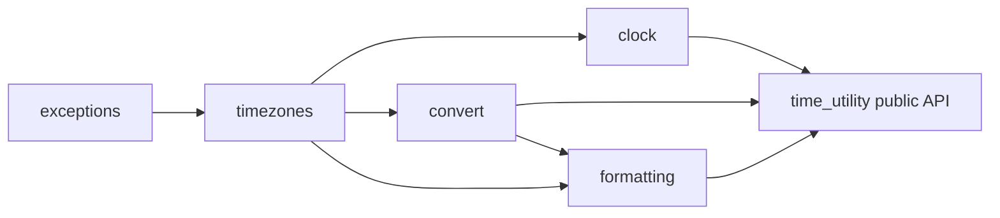

# 技術設計書

## Overview
本機能は、日本国内向け開発を主対象とする `python_util` パッケージに、JST(Asia/Tokyo)をデフォルトとする時刻ユーティリティ群を追加する。標準ライブラリの `datetime` / `zoneinfo` を直接扱う際に発生しがちなタイムゾーン指定漏れや `locale` 設定の煩雑さを解消し、現在時刻取得・タイムゾーン変換・日本語形式でのフォーマット/パースを簡潔なAPIで提供する。

**Purpose**: JSTを前提とした日時操作を、外部依存やロケール設定なしに簡潔に行えるユーティリティ関数群を提供する。
**Users**: 本パッケージを利用する個人プロジェクトの開発者(自分自身)が、ログ出力・レポート生成・外部API連携などで日時を扱う際に利用する。
**Impact**: 新規モジュールの追加のみであり、既存の `logging` モジュール等には影響しない。

### Goals
- 特に指定がない限りJSTを前提として現在時刻取得・フォーマット・パースが行えること
- JST/UTC/任意タイムゾーン間の変換を、naive/awareの違いを意識せず簡潔に行えること
- `locale.setlocale` 等のグローバルなロケール設定なしで日本語表記の日時文字列を扱えること
- 不正な入力(未知のタイムゾーン名、不正な形式の文字列、非対応の型)に対して明確な例外を送出すること

### Non-Goals
- 祝日判定・営業日計算などのカレンダー機能
- スケジューリング/タイマー/定期実行機能
- 日本語以外のロケールでの曜日・月名表示

## Boundary Commitments

### This Spec Owns
- JSTをデフォルトとした現在時刻取得、タイムゾーン変換、日時のフォーマット/パースの公開API(`python_util.time_utility` パッケージ)
- naiveなdatetimeをJSTとして解釈するという既定挙動の定義
- タイムゾーン名解決・日時パース失敗時に送出する例外型の定義

### Out of Boundary
- 祝日・営業日等のカレンダー計算(将来別specとして検討)
- ロギング出力そのもの(`python_util.logging` が担当し、本specは依存しない)
- アプリケーション側でのタイムゾーン設定のグローバル管理(本ユーティリティは呼び出しごとに明示/既定値で解決し、プロセス全体の状態は持たない)

### Allowed Dependencies
- Python標準ライブラリ: `datetime`, `zoneinfo`
- 環境依存の必須パッケージ: `tzdata`(`sys_platform == "win32"` 環境限定の依存。WindowsはOSにIANAタイムゾーンDBを同梱しないため、Windowsでの利用が確定している本プロジェクトでは条件付き必須依存として扱う)
- 既存の `structure.md` に定義されたパッケージ構成規約(`src/python_util/` 配下、snake_case命名)

### Revalidation Triggers
- `time_utility` の公開関数シグネチャ(引数・返り値の型、例外型)を変更する場合
- JST解決方法(`zoneinfo.ZoneInfo("Asia/Tokyo")`)を固定オフセット等の別実装に変更する場合
- naiveなdatetimeの既定タイムゾーン解釈(JST)を変更する場合

## Architecture

### Architecture Pattern & Boundary Map
単純な関数ベースのユーティリティモジュール群であり、外部システムとの連携は発生しない。既存の `python_util.logging` パッケージと同様に、機能別モジュールへ処理を分割し `__init__.py` で公開APIを集約する。



**Architecture Integration**:
- 選定パターン: 状態を持たない関数群 + 値オブジェクト(Enum/frozen dataclass は不要なため未使用)。既存 `logging` パッケージの「機能別モジュール分割 + `__init__.py` 集約」パターンを踏襲する
- ドメイン境界: タイムゾーン解決(`timezones`)、時刻取得(`clock`)、変換(`convert`)、フォーマット/パース(`formatting`)を明確に分離し、各モジュールは単一責務を持つ
- 既存パターンの踏襲: `python_util.logging` と同じディレクトリ構成・命名規則・公開API絞り込み方針
- 新規コンポーネントの理由: JST解決とnaive/aware変換は複数モジュールから共通利用されるため、`timezones`/`convert` として独立させ重複実装を避ける
- ステアリング遵守: 標準ライブラリ中心・外部依存最小という `tech.md` の方針に従い、新規の必須外部依存は追加しない

### Technology Stack

| Layer | Choice / Version | Role in Feature | Notes |
|-------|------------------|------------------|-------|
| ランタイム | Python >= 3.11(既存 `requires-python` を維持) | `zoneinfo` 標準搭載バージョン | 変更なし |
| 日時/タイムゾーン | 標準ライブラリ `datetime`, `zoneinfo` | JST解決、変換、フォーマット/パースの基盤 | 追加の必須依存なし |
| タイムゾーンDBフォールバック | `tzdata`(`sys_platform == "win32"` 限定の条件付き必須依存) | Windows環境での `zoneinfo` 動作保証(WindowsはIANAタイムゾーンDBをOSに同梱しないため) | Windowsでの利用が確定しているため必須。詳細は `research.md` 参照 |

依存関係の方向は `exceptions → timezones → {clock, convert} → formatting → __init__(公開API)` の順に固定し、各層は左側の層のみを参照できる。

## File Structure Plan

### Directory Structure
```
src/
└── python_util/
    └── time_utility/
        ├── __init__.py     # 公開API(now, to_jst, to_utc, to_timezone, format_datetime, parse_datetime, JST, DateTimeFormat, 例外)を再エクスポート
        ├── exceptions.py   # InvalidTimezoneError, DateTimeParseError
        ├── timezones.py    # JST定数、resolve_timezone()
        ├── clock.py        # now()
        ├── convert.py      # ensure_aware(), to_jst(), to_utc(), to_timezone()
        └── formatting.py   # DateTimeFormat, format_datetime(), parse_datetime(), 日本語曜日テーブル
```

既存の `logging` パッケージと同一パターン(機能別モジュール + `__init__.py` での公開API集約)に従う。

### Modified Files
- `pyproject.toml` — `tzdata` を `sys_platform == "win32"` 限定の依存として `dependencies` に追加

テストは `tests/time_utility/` に上記各モジュールをミラーリングする形で配置する(`tests/logging/` と同様の構成)。

## Requirements Traceability

| Requirement | Summary | Components | Interfaces | Flows |
|-------------|---------|-------------|------------|-------|
| 1.1, 1.2, 1.3 | JST基準の現在時刻取得 | `clock`, `timezones` | `now()` | - |
| 2.1, 2.2, 2.3, 2.4 | タイムゾーン変換 | `convert`, `timezones` | `to_jst()`, `to_utc()`, `to_timezone()`, `ensure_aware()` | - |
| 3.1, 3.2, 3.3, 3.4 | 日時のフォーマットとパース | `formatting`, `convert` | `format_datetime()`, `parse_datetime()`, `DateTimeFormat` | - |
| 4.1, 4.2 | naiveなdatetimeのJST既定扱い | `convert` | `ensure_aware()` | - |
| 5.1, 5.2 | エラーハンドリング | `timezones`, `clock`, `convert`, `formatting`, `exceptions` | `resolve_timezone()`, `now()`, `to_jst()`/`to_utc()`/`to_timezone()`, `format_datetime()`, `parse_datetime()`, `InvalidTimezoneError`, `DateTimeParseError` | - |

## Components and Interfaces

| Component | Domain/Layer | Intent | Req Coverage | Key Dependencies (P0/P1) | Contracts |
|-----------|---------------|--------|----------------|----------------------------|-----------|
| exceptions | 基盤 | 本ユーティリティ固有の例外型を定義 | 5.1, 5.2 | なし | State |
| timezones | タイムゾーン解決 | JST定数の提供とタイムゾーン名/オブジェクトの解決 | 1.2, 1.3, 2.1-2.4, 5.1 | exceptions (P0) | Service |
| clock | 時刻取得 | JSTを既定とした現在時刻の取得 | 1.1, 1.2, 1.3, 5.2 | timezones (P0) | Service |
| convert | 変換 | naive/awareの相互変換、タイムゾーン間変換 | 2.1-2.4, 4.1, 4.2, 5.2 | timezones (P0) | Service |
| formatting | フォーマット/パース | 日本語表記でのフォーマットとJST既定でのパース | 3.1-3.4, 5.2 | convert (P0), timezones (P0), exceptions (P0) | Service |

### 基盤

#### exceptions

| Field | Detail |
|-------|--------|
| Intent | タイムゾーン解決・日時パース失敗を表す専用例外を提供する |
| Requirements | 5.1, 5.2 |

**Responsibilities & Constraints**
- `ValueError` を基底とし、既存の `try/except ValueError` を用いる呼び出し側コードとの互換性を保つ
- 例外メッセージには問題のある入力値を含め、原因特定を容易にする

**Dependencies**
- なし(最下層のモジュール)

**Contracts**: Service [x] / API [ ] / Event [ ] / Batch [ ] / State [ ]

##### Service Interface
```python
class InvalidTimezoneError(ValueError):
    """不正なタイムゾーン名またはタイムゾーンオブジェクトが指定された場合に送出される。"""

class DateTimeParseError(ValueError):
    """日時文字列のパースに失敗した場合に送出される。"""
```
- Preconditions: なし
- Postconditions: 例外インスタンスは元の入力値を含むメッセージを保持する
- Invariants: いずれも `ValueError` のサブクラスであり、既存の `ValueError` ハンドリングと互換

**Implementation Notes**
- Integration: `timezones.resolve_timezone` と `formatting.parse_datetime` から送出される
- Validation: 該当なし(例外定義のみ)
- Risks: なし

### タイムゾーン解決

#### timezones

| Field | Detail |
|-------|--------|
| Intent | JST定数を提供し、文字列/`tzinfo`/`None` を `tzinfo` に解決する |
| Requirements | 1.2, 1.3, 2.1, 2.2, 2.3, 2.4, 5.1 |

**Responsibilities & Constraints**
- `JST = ZoneInfo("Asia/Tokyo")` を唯一の真実源として提供する(他モジュールはこの定数を再利用する)
- タイムゾーン未指定(`None`)の場合は常にJSTへ解決する
- 存在しないタイムゾーン名が渡された場合は `zoneinfo.ZoneInfoNotFoundError` を捕捉し `InvalidTimezoneError` として再送出する

**Dependencies**
- Outbound: `exceptions.InvalidTimezoneError` — 不正なタイムゾーン名の通知 (P0)
- External: 標準ライブラリ `zoneinfo` — IANAタイムゾーンDB解決 (P0)

**Contracts**: Service [x] / API [ ] / Event [ ] / Batch [ ] / State [ ]

##### Service Interface
```python
from datetime import tzinfo
from zoneinfo import ZoneInfo

JST: tzinfo  # ZoneInfo("Asia/Tokyo")

def resolve_timezone(tz: str | tzinfo | None) -> tzinfo:
    """文字列/tzinfo/Noneを受け取りtzinfoへ解決する。Noneの場合はJSTを返す。"""
```
- Preconditions: `tz` が文字列の場合はIANAタイムゾーン名であること
- Postconditions: 常に有効な `tzinfo` インスタンスを返す(例外を送出しない限り)
- Invariants: `tz is None` の場合は常に `JST` と同一の `tzinfo` を返す

**Implementation Notes**
- Integration: `clock`, `convert`, `formatting` の全モジュールから呼び出される、本specにおける唯一のタイムゾーン解決経路
- Validation: `ZoneInfoNotFoundError` を `InvalidTimezoneError` に変換して送出する
- Risks: OSにタイムゾーンDBが無い環境では `tzdata` パッケージが未導入だと解決に失敗する(`research.md` のリスク参照)

### 時刻取得

#### clock

| Field | Detail |
|-------|--------|
| Intent | JSTを既定とした現在時刻(aware datetime)を取得する |
| Requirements | 1.1, 1.2, 1.3, 5.2 |

**Responsibilities & Constraints**
- 返り値は常にawareな `datetime`(tzinfo付き)であること
- タイムゾーン指定がない場合はJSTを使用する

**Dependencies**
- Outbound: `timezones.resolve_timezone` — タイムゾーン解決 (P0)

**Contracts**: Service [x] / API [ ] / Event [ ] / Batch [ ] / State [ ]

##### Service Interface
```python
from datetime import datetime, tzinfo

def now(tz: str | tzinfo | None = None) -> datetime:
    """指定タイムゾーン(既定JST)における現在時刻をawareなdatetimeで返す。"""
```
- Preconditions: `tz` は `resolve_timezone` が解決可能な値であること
- Postconditions: 返り値の `tzinfo` は解決されたタイムゾーンと一致する
- Invariants: 返り値は常にaware(`tzinfo is not None`)

**Implementation Notes**
- Integration: `datetime.now(tz=resolve_timezone(tz))` を内部的に呼び出す
- Validation: 不正な `tz` は `timezones.resolve_timezone` が `InvalidTimezoneError` を送出する。`tz` が `str`/`tzinfo`/`None` のいずれでもない場合は `TypeError` を送出する(要件5.2)
- Risks: なし

### 変換

#### convert

| Field | Detail |
|-------|--------|
| Intent | naive/awareの相互変換、およびJST/UTC/任意タイムゾーン間の変換を提供する |
| Requirements | 2.1, 2.2, 2.3, 2.4, 4.1, 4.2, 5.2 |

**Responsibilities & Constraints**
- naiveなdatetimeは、呼び出し側が明示的な `default_tz` を指定しない限り常にJSTとして解釈する
- awareなdatetimeの変換では元の時刻(UTC換算値)を変えず、`tzinfo` のみを変更する

**Dependencies**
- Outbound: `timezones.resolve_timezone`, `timezones.JST` — タイムゾーン解決 (P0)

**Contracts**: Service [x] / API [ ] / Event [ ] / Batch [ ] / State [ ]

##### Service Interface
```python
from datetime import datetime, tzinfo

def ensure_aware(dt: datetime, default_tz: tzinfo = JST) -> datetime:
    """naiveなdatetimeにdefault_tzを付与してawareにする。既にawareな場合はそのまま返す。"""

def to_jst(dt: datetime) -> datetime:
    """datetimeをJSTに変換する。naiveな場合はJSTとして解釈済みとみなす。"""

def to_utc(dt: datetime) -> datetime:
    """datetimeをUTCに変換する。naiveな場合はJSTとして解釈してから変換する。"""

def to_timezone(dt: datetime, tz: str | tzinfo) -> datetime:
    """datetimeを指定タイムゾーンに変換する。naiveな場合はJSTとして解釈してから変換する。"""
```
- Preconditions: `dt` は `datetime` 型であること(`None` や非対応の型は `TypeError`)
- Postconditions: 返り値は常にawareな `datetime` であり、変換前後で同一の絶対時刻(UTC換算値)を表す
- Invariants: naiveな入力は常にJSTとして解釈される(要件4.1)。`default_tz` を明示指定した場合はその値が優先される(要件4.2)

**Implementation Notes**
- Integration: `formatting.parse_datetime` の内部でも `ensure_aware`/`to_jst` を利用し、JST既定解釈を一貫させる
- Validation: `dt` が `datetime` 以外の場合は `TypeError` を送出する(要件5.2)
- Risks: なし

### フォーマット/パース

#### formatting

| Field | Detail |
|-------|--------|
| Intent | ロケール設定なしで日本語表記の日時文字列を生成・解析する |
| Requirements | 3.1, 3.2, 3.3, 3.4, 5.2 |

**Responsibilities & Constraints**
- `locale` モジュールを使用せず、固定の日本語曜日名テーブルで曜日表記を解決する
- あらかじめ定義済みのフォーマット(`DateTimeFormat`)を選択可能にする
- パース時、タイムゾーン情報を含まない文字列はJSTとして解釈する

**Dependencies**
- Outbound: `convert.ensure_aware`, `convert.to_jst` — naive/aware解釈の統一 (P0)
- Outbound: `timezones.resolve_timezone` — パース時のタイムゾーン解決 (P0)
- Outbound: `exceptions.DateTimeParseError` — パース失敗の通知 (P0)

**Contracts**: Service [x] / API [ ] / Event [ ] / Batch [ ] / State [ ]

##### Service Interface
```python
from datetime import datetime, tzinfo
from enum import Enum

class DateTimeFormat(Enum):
    ISO = "iso"                        # 2026-07-11T09:00:00+09:00
    DATE = "date"                      # 2026-07-11
    DATETIME = "datetime"              # 2026-07-11 09:00:00
    JAPANESE_DATE = "japanese_date"            # 2026年07月11日(土)
    JAPANESE_DATETIME = "japanese_datetime"    # 2026年07月11日(土) 09:00:00

def format_datetime(dt: datetime, fmt: DateTimeFormat | str = DateTimeFormat.DATETIME) -> str:
    """datetimeを指定フォーマットの文字列に変換する。localeモジュールは使用しない。
    dtがdatetime型でない場合はTypeErrorを送出する(要件5.2)。"""

def parse_datetime(
    text: str,
    fmt: DateTimeFormat | str | None = None,
    tz: str | tzinfo = JST,
) -> datetime:
    """日時文字列をdatetimeに変換する。タイムゾーン情報を含まない場合はtz(既定JST)として解釈する。"""
```
- Preconditions: `fmt` に `str` を渡す場合は `strftime`/`strptime` 互換の書式文字列であること
- Postconditions: `parse_datetime` の返り値は常にawareな `datetime`
- Invariants: `format_datetime` は `locale.setlocale` を呼び出さない
- `fmt=None` 時の解決規則: 以下の優先順位で `text` の解析を試行し、最初に成功したものを採用する。すべて失敗した場合は `DateTimeParseError` を送出する
  1. `DateTimeFormat.ISO`(`datetime.fromisoformat` 相当)
  2. `DateTimeFormat` の残りのメンバー(`DATETIME` → `DATE` → `JAPANESE_DATETIME` → `JAPANESE_DATE` の順)

**Implementation Notes**
- Integration: `DateTimeFormat` の日本語系メンバーは `convert` 層を経由せず、`dt.weekday()` から固定テーブルを引いて曜日名を組み立てる
- Validation: `text` が `fmt` に一致しない場合、標準ライブラリが送出する `ValueError` を捕捉し `DateTimeParseError` として再送出する(要件3.4)
- Risks: 事前定義フォーマットに存在しないカスタム書式を必要とするケースは、`fmt` に `str` を直接渡すことで対応する(拡張性の担保)

## Data Models

### Domain Model
本機能はステートレスな値変換のみを扱い、永続化されるエンティティは存在しない。唯一のドメイン概念は次の値オブジェクトである。

- `DateTimeFormat`(Enum): 事前定義された日時フォーマットの識別子。不変であり、`formatting.format_datetime`/`parse_datetime` の引数として使用される
- 例外型(`InvalidTimezoneError`, `DateTimeParseError`): エラー状態を表す値。副作用を持たない

## Error Handling

### Error Strategy
すべてのエラーは標準ライブラリの例外階層(`ValueError`/`TypeError`)を継承した専用例外、または標準例外そのものとして送出し、呼び出し側が `except ValueError` / `except TypeError` で既存コードと同様にハンドリングできるようにする。

### Error Categories and Responses
- **不正なタイムゾーン指定**(要件5.1): `timezones.resolve_timezone` が `zoneinfo.ZoneInfoNotFoundError` または不正な型を検知した場合、指定値を含むメッセージとともに `InvalidTimezoneError` を送出する
- **不正な日時文字列**(要件3.4): `formatting.parse_datetime` が書式不一致を検知した場合、入力文字列と期待フォーマットを含むメッセージとともに `DateTimeParseError` を送出する
- **非対応の型/None**(要件5.2): `convert` 系関数が `datetime` 以外(`None` を含む)を受け取った場合、`clock.now`/`convert.to_timezone` が `tz` に `str`/`tzinfo`/`None` 以外を受け取った場合、`formatting.format_datetime` が `dt` に `datetime` 以外を受け取った場合のいずれも、`TypeError` を送出する

## Testing Strategy

### Unit Tests
- `timezones.resolve_timezone`: `None` → JST解決、有効な文字列 → 対応する `ZoneInfo`、不正な文字列 → `InvalidTimezoneError`
- `clock.now`: 引数なし呼び出しでJSTのaware datetimeが返ること、タイムゾーン指定時にそのタイムゾーンで返ること
- `convert.ensure_aware` / `to_jst` / `to_utc` / `to_timezone`: naive入力のJST既定解釈、aware入力の絶対時刻保持、`default_tz` 明示指定時の優先
- `formatting.format_datetime` / `parse_datetime`: 各 `DateTimeFormat` での往復変換(format→parse で元の値を復元)、日本語曜日表記の正しさ、不正文字列での `DateTimeParseError`

### Integration Tests
- `now()` で取得した値を `format_datetime` でフォーマットし、`parse_datetime` で再度パースして元のawareな値と一致することを確認する一連のフロー
- `to_utc` で変換した値を再度 `to_jst` で戻した際に元の値と一致することを確認するラウンドトリップ
- 不正なタイムゾーン名を `now`/`to_timezone`/`parse_datetime` それぞれに渡した際に一貫して `InvalidTimezoneError` が送出されることの確認
